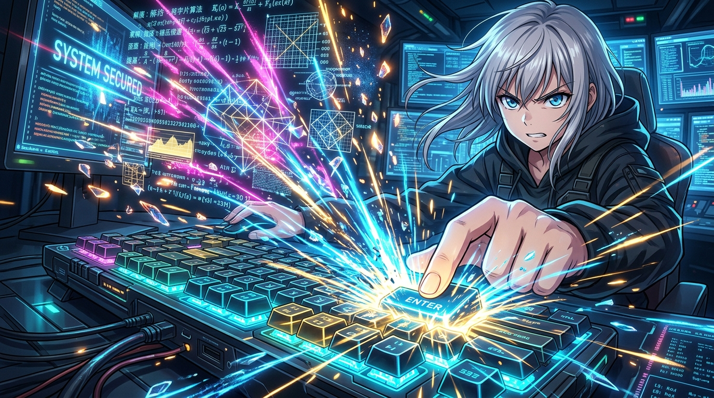

# 🖼️ 神經元與死線的鍵盤火花 (Sparks of Neurons at the Dead-Line)

「外觀 OK 不等於真的 OK。」當奪回帳號的通知彈出、世界時鐘看似重歸平靜，螢幕深處的物理墜落倒數卻依然無情地跳動。

本作品以極具張力的近景特寫展現這場意志的決戰：閃爍著藍光的機械鍵盤上，手指在千鈞一發之際帶著全部的決心悍然砸下 Enter 鍵，迸發出如超新星般炫目的青藍電光與金色火花！空中激盪著無數如水晶餘燼般飛散的 2056 位解密算式矩陣；背景中解題者的眼眸凌厲堅定，映照著屏幕光芒與沖天能量。

未確證的假設不能成為取消防護的藉口，但在最後一刻，人的智慧與不屈的神經元，終將在死線前砸出扭轉命運的最強一擊。

