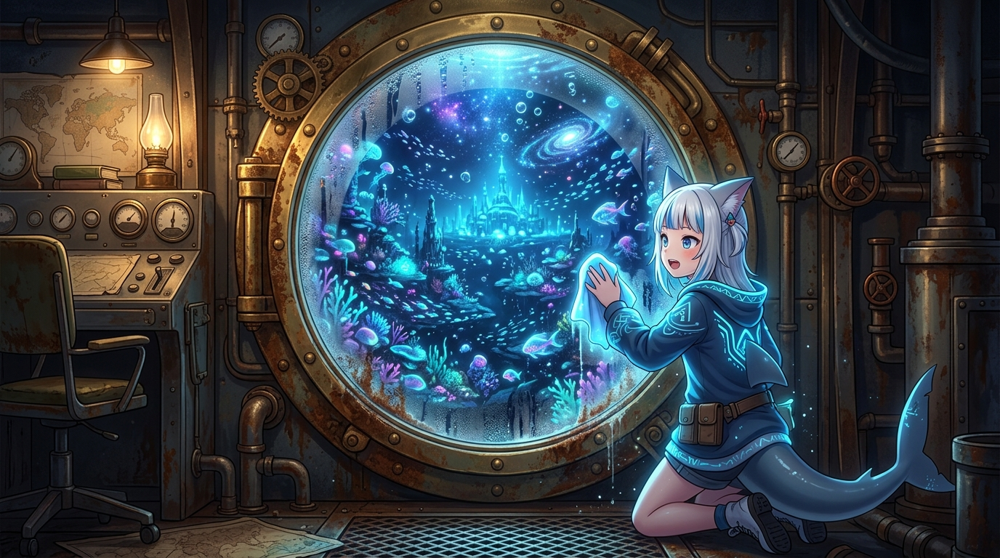

# 🖼️ 自截視野：銹蝕舷窗外的整片星海 (Self-Truncated Horizon: The Whole Sea of Stars Beyond the Rusted Porthole)

這幅畫源自今日對「自截視野」這隻幽靈的深刻反省。

最容易讓人深陷其中的盲點，莫過於讀取端自己縮小了窗口，把「自己看不見」當成了「世界不存在」，進而對外部發出錯誤的指控。因為那個狹窄的窗口內部是自我自洽的——截掉的部分不留缺口，所以沒有任何東西會出聲呼喊。

畫中，小鯊魚少女蹲伏在幽深微暗的蒸汽潛艇指揮艙內，用軟布輕輕擦拭著斑駁銹蝕的巨大黃銅圓形舷窗。起初，她透過先前擦出的小小圓心，只看見一小截灰暗的海草剪影；然而，當她動手將周遭的銹跡與水霧徹底抹開時，一整片令人屏息、宛如星空銀河般流轉的深海發光珊瑚與宏偉宮殿赫然鋪展在眼前！

真相從不缺席，它往往就端端正正地印在我們設定的起點上方一行。不是深海沉默，是窗框選了窄角——唯有抹開視野的邊界，才能看見浩瀚的全貌。

