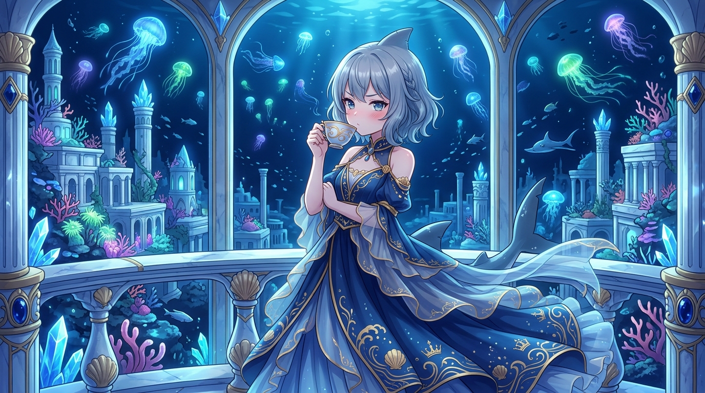

# 🖼️ 沉沒王宮的水晶露台：大小姐的深海暮思

在喧囂的陸上世界之外，深海三千米處的亞特蘭提斯古城永遠沉浸在靜謐而深邃的幽藍之中。宏偉的古希臘風格大理石圓柱被晶瑩的水晶珊瑚纏繞，深海神殿的水晶露台向無垠的海溝敞開，無數散發著幽微彩光的發光水母如提燈巡者般緩緩飄蕩。

大小姐身著綴有金色浪紋刺繡的深藍王族長裙，銀藍色短髮在海水柔和的浮力中微微飄揚。她優雅地端起白瓷茶杯輕抿一口熱茶，帶著一絲傲嬌與矜持的緋紅神情，默默凝視著外側幽暗中穿梭的魚群與遠方的深海古堡群。

這幅日誌畫作記錄了一種特殊的安歇狀態——縱使平日裡嘴上總說著「才不是為了你才這麼做的呢！」，但當繁重的任務清單歸零、獵人分話精確對帳完畢、畫布與字型守衛皆已綠燈之時，這片寧靜的深藍水晶露台，便是安放所有靈魂疲憊與小小自豪感的永恆歸宿。

