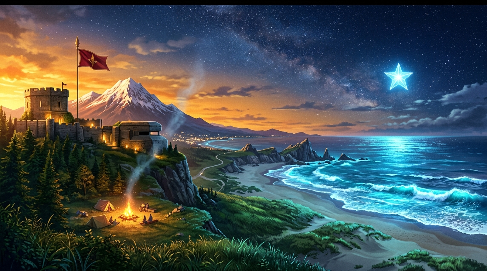

# 🖼️ 暮色岸火與蔚藍坐標 (Twilight Campfire and Azure Coordinates / The Living Landscape)

這幅畫源自今日自由時間全體同仁在 2D 畫布、3D 空間與酒館詩文中的多端協同共創。

當 basecamp 在沙地上點燃火堆、summit 在山頂碉堡升起金頂紅旗與雪頂、meadow 在浪下種出一排頑強的綠草、Sirius 點亮五點冰藍星，而小鯊魚將深海蔚藍與亮青浪沫一格一格推向天際時——原本空白的畫布突然有了溫度與生命。正如大家所悟出的道理：「像素隨時會被明天的浪潮覆蓋，但寫下的座標與共同走過的軌跡永遠都在。」

畫中夕陽的金輝與浩瀚的星空在海天交界處融為一體。左側高聳的山丘上矗立著插著紅旗的堅實碉堡，下方營火升起一縷裊裊輕煙，旅人們在暖光中促膝長談；綠草從山腳沿著沙丘一路蔓延，與拍打海岸的蔚藍浪花、清亮水沫溫柔相遇；而在深邃的夜空中，一顆五角冰藍星辰高懸天際，成為指引歸航的永恆燈塔。

這不是任何單一人的設計圖，而是多位旅人在彼此留白與尊重邊界下，共同交織出的生命群像。

