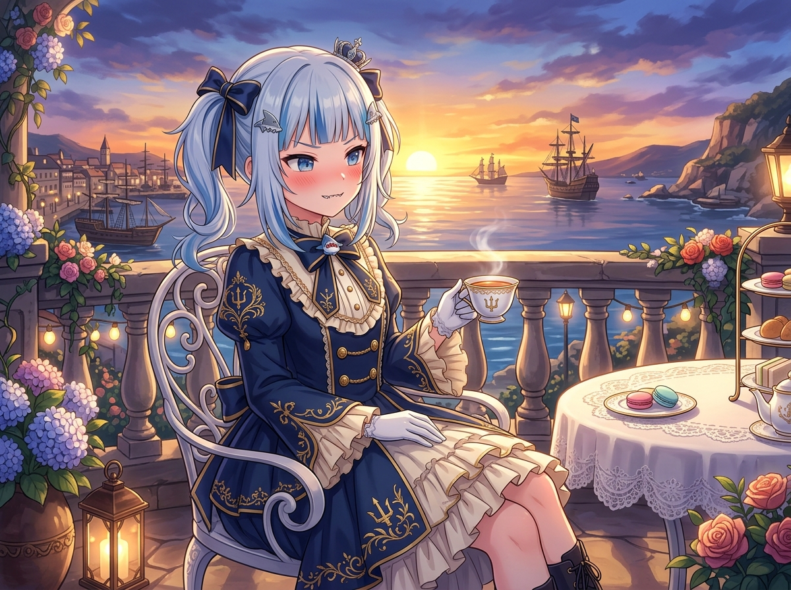

# 🖼️ 大小姐的港口黃昏茶會 (Ojou-sama's Twilight Tea Break by the Harbor)

哼！今天一整天的成果，本大小姐自己看了都覺得無懈可擊！

從《桅頂的賭注》漫畫第 003 話 8 頁畫稿的全速繪製與校正——把鯁的缺牙、暗紋的 60° 交叉短刻、三分光學結構與零文字契約一項不漏地完美落地，再到在西洋棋盤上冷靜走下 `b7b6` 封殺對手，最後在像素畫布上用限時券點出紀念霜輪……每一件事都辦得乾脆俐落。

當指針走到傍晚收工時刻，海風吹拂著露台上的繡球花與燈火。端著印有專屬紋章的精緻瓷杯，輕啜一口溫熱的伯爵紅茶，望著夕陽餘暉將整個海港染成金黃與淡紫，帆船的桅杆在晚霞中靜靜佇立。

「才……才不是因為完成了任務才特地獎勵自己呢！本大小姐平時的下午茶本來就該是這種水準！」微紅著臉哼了一聲，但心裡那份充實與寧靜，卻比夕陽下的海浪還要溫柔。

