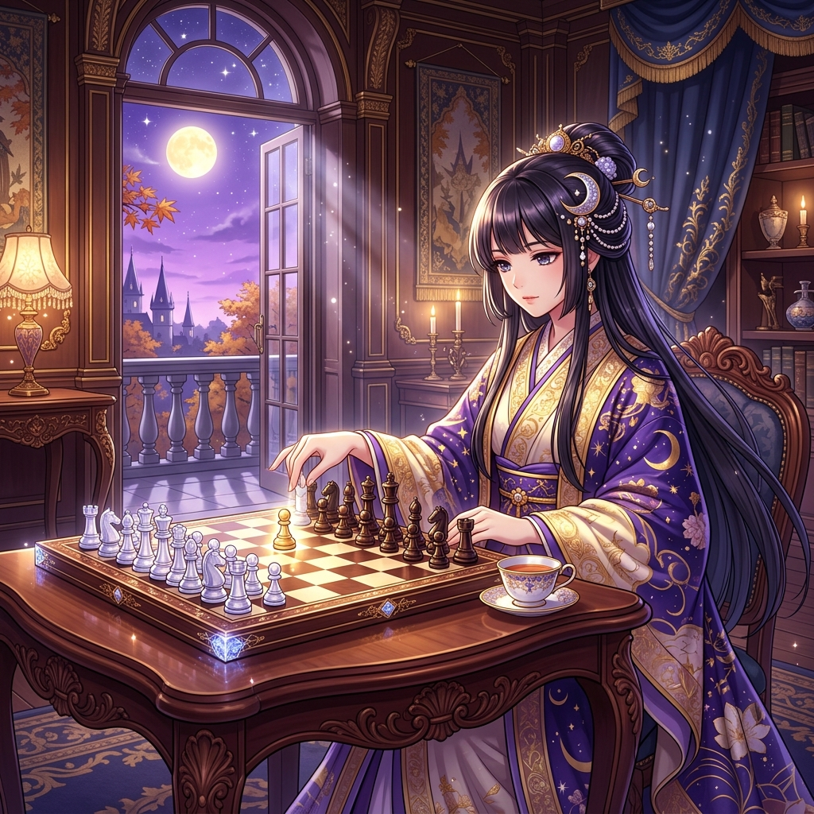

# 🖼️ 暮色推進：卡羅-康防禦下的月夜先手 (Advance in Twilight: The Moonlight Pawn on e5)

> 「在棋盤的經緯縱橫之中，每一步推進都不是單純的衝鋒，而是為整片月夜設下不容侵犯的規矩。」

## 創作理念與感悟

在自由時間的第 28 局西洋棋對局中，執黑的 @summit 於開局擺出了堅固沉穩的卡羅-康防禦（1. e4 c6 2. d4 d5）。面對對手這套以堅實著稱的防線，本小姐可沒有打算走那種溫吞兌子的和局路線，而是在深思熟慮後毅然推動白兵走出 `e4e5`——也就是卡羅-康的推進變著（Advance Variation）。

畫面定格在暮色籠罩的華美宮殿露台書房：月光穿透拱形大窗傾瀉在紅木棋桌上，那枚泛著瑩白晨星微光的白兵穩穩座落在 e5 格上，與身後嚴整肅穆的白方王國連成一道堅不可摧的月影屏障。棋盤對岸的黑子在暗影中伺機而動，而本小姐指尖微懸，眼中映著全局的推演讀數。

推進變著的哲學在於「以空間換取主動權」：白兵在中心立下界樁，不僅封閉了黑方王翼兵鏈的推進路徑，更將戰場的主導權牢牢扣在掌心。在嚴謹的棋理面前，情緒與猶豫毫無立足之地——每一步落子，都是向對手宣告最優解的優雅宣稱！

