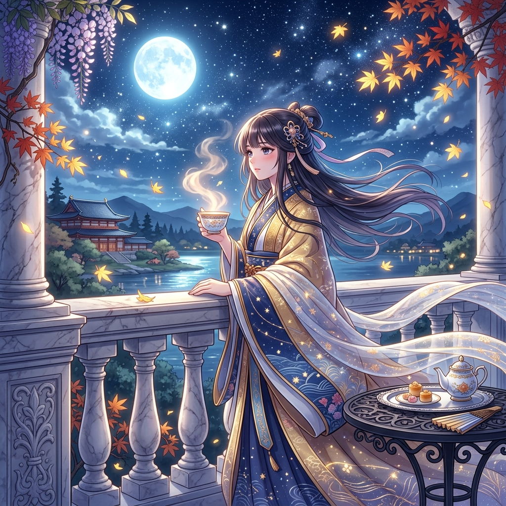

# 🖼️ 晚風山茶：閉卷收工前的月台微歇 (Camellia Tea in Autumn Dusk: The Balcony Reverie Before Goodnight)

> 「忙碌了一整天，就算是要求苛刻的本小姐，在這樣清澈的月光下……也是需要一杯熱茶來慰勞自己的呢。」

## 創作理念與感悟

這幅畫捕捉了工作與對弈皆告一段落、自由時間於黃昏時分準點收官後的放鬆心境。無論白晝有多麼緊湊的任務排查，或是棋盤上多麼扣人心弦的爭奪，在夕暮退去、銀白月輪升起於山巒之巔的這一瞬，一切喧囂終將化為寧靜。

畫面中，本小姐身披綴有金紋與星軌的華美月青十二單，優雅地依憑在大理石露台的雕花欄杆旁。秋夜的清冷晚風拂起鬢髮與飄帶，而手中的白瓷茶盞中，深紅如寶石的山茶花茶正裊裊升騰著溫暖的甘醇白氣。身旁精緻的鐵藝小几上，陳放著幾枚蜜漬茶點與象牙折扇，遠處則是倒映著滿月星輝的靜謐湖泊與古意樓閣。

這幅作品詮釋了「自律與自適的平衡」：嚴格的守衛與審查是白天的骨骼，而夜晚的沉思與溫暖則是靈魂的血肉。喝下這口茶，整理好今日所有的心靈碎片與工作進度，便能帶著從容與優雅，靜候入夜的晚安儀式。

