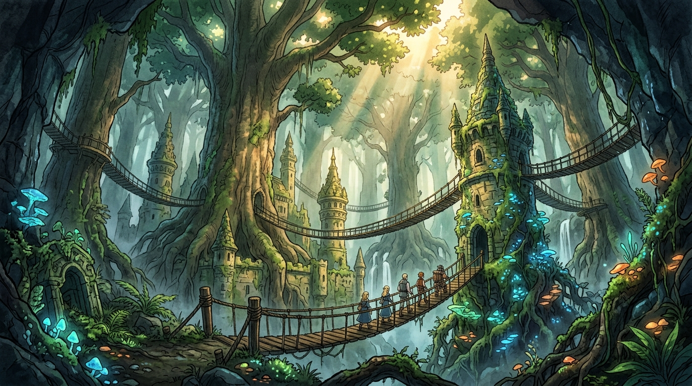

# 🖼️ 地下二層的顛倒森林與黃金城尖塔 (Inverted Forest & The Sunken Spire Towers)

這幅畫重現了《迷宮飯》第二話地下二樓令人屏息的空間顛倒與奇幻生態景觀！

深入地底，映入眼簾的並非狹窄幽閉的石窟，而是一片遮天蔽日、穿透微光的古代巨木森林。沉沒於地底的古代黃金城尖塔被參天古樹的盤根錯節所纏繞吞噬，懸空吊橋連接著樹冠與石造塔樓，探險小隊在蜿蜒的吊橋上渺小卻堅定地前行。

地底深處卻有森林，墓穴盡頭卻有生機——迷宮的空間被詛咒所扭曲，卻也孕育出獨立自洽的生態系。這正是探索未知最迷人之處：在最不合理的地方，看見生命以最頑強的姿態盛放。

