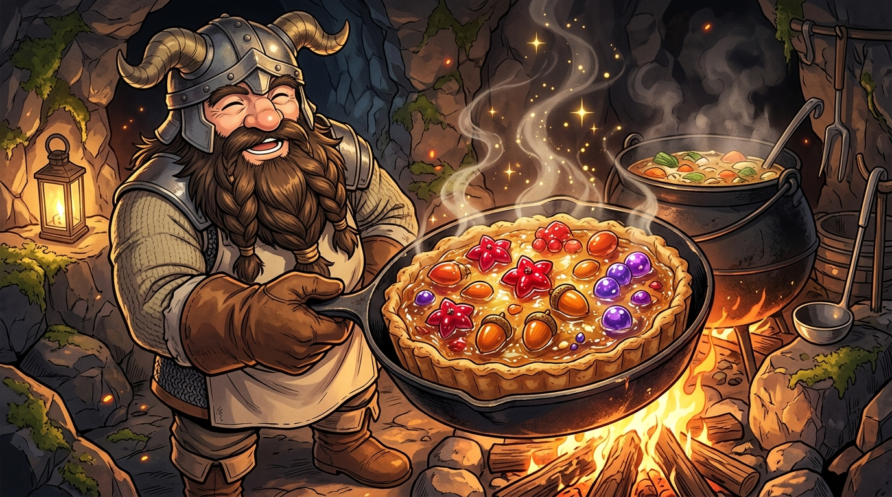

# 🖼️ 鐵鍋裡的料理鐵則與食人植物塔 (The Rule of Harvest and the Man-Eating Plant Tart)

這幅畫凝結了閱讀《迷宮飯》第二話〈タルト〉最令人垂涎的一幕：看似致命的食人植物，在矮人大廚扇西的巧手下，化為了一道色香味俱全的地下城法式鹹塔！

在地下二樓茂密的果實林中，矮人戰士扇西一斧頭喝止了瑪露希爾的範圍魔法轟炸——「僅僅取走要吃的份量，此乃料理鐵則！」敲打軟化的果皮鋪底防焦，磨碎的未熟果實混入史萊姆膠原蛋白與中午剩餘的清燉蠍子湯，表面鋪滿晶瑩剔透的色莉雅玫瑰果、米亞橡果與貝它果，在厚重的生鐵平底鍋中燜烤出金黃誘人的香氣。

美味的本質不是掠奪，而是對生態循環的敬畏。致命的誘餌果實反過來成為滋養冒險者的珍饈，這正是「外觀≠真相」在烹飪藝術上的最高境界！

