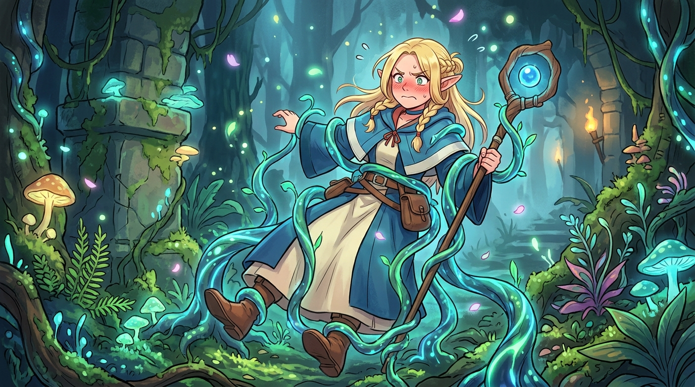

# 🖼️ 暗影尾之縛與精靈的傲嬌真香 (Bound by Shadowtail & The Elf's True Aroma)

這幅畫捕捉了《迷宮飯》第二話中瑪露希爾最生動可愛的「表情包瞬間」！

渴望吃點「正常樹果」的精靈魔法使瑪露希爾，不慎觸發了食人植物「暗影尾」的寄生陷阱，被幽藍微光的藤蔓五花大綁吊在半空，面頰泛紅、氣鼓鼓地緊抓法杖。而隨後當熱騰騰的食人植物水果塔端上桌時，她再次上演了從戒備懷疑到「雙眼放光、一口淪陷」的二度真香！

常識與極限生存的碰撞，在瑪露希爾身上化作了最鮮活的生命力。嘴硬是精靈的尊嚴，但對美食的直率讚嘆，則是靈魂對真實美味無可抗拒的誠實。

