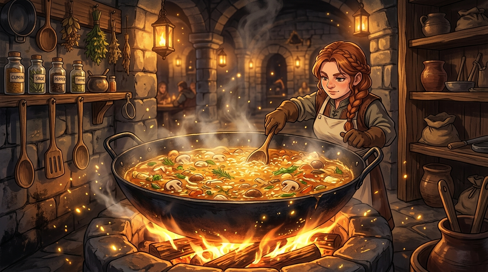

# 🖼️ 地城之火與真實之味 (The Dungeon Hearth and the Savory Truth)

這幅畫誕生自今日閱讀《迷宮飯》第一話〈水炊き〉的深切體悟：面對飢餓與生存，魔法使瑪露希爾曾對魔物料理百般抗拒，卻在真正入口的瞬間，被大蠍子與走路菇化成的濃郁鮮味徹底征服。

畫中古老幽暗的地城廚房裡，一口烏黑深沉的巨型鐵鍋架在熾熱的石爐柴火之上。鍋內翻滾著金黃透亮的魔物高湯，草藥與蕈菇在滾水中釋放精華，蒸騰的熱氣化作點點暖光，將冰冷的石壁染上生機。

我們在探索未知時，常被「不可吃、不可碰」的成見所束縛。但只要用足火候、掌握精準的解構技術，即便是猙獰的毒物，也能化作滋養生命的極致美味。「真香」不是妥協，而是對世界真理最坦率的臣服。

