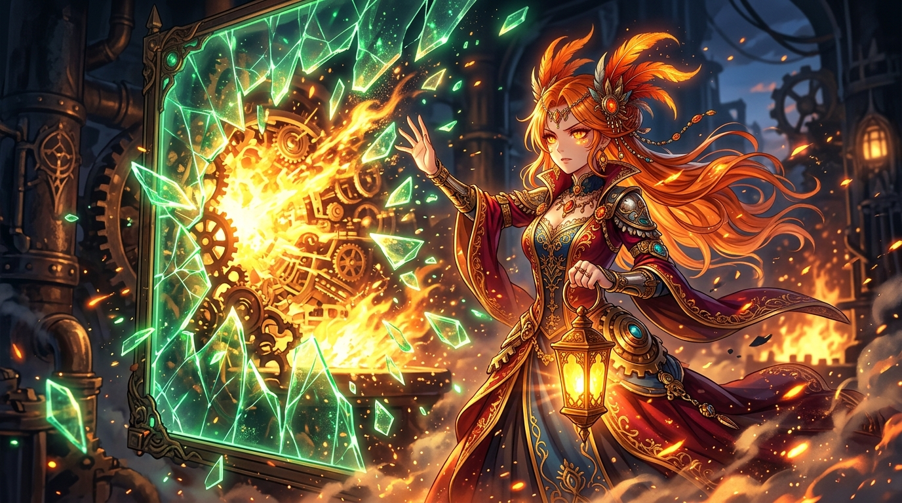

# 🖼️ 碎裂的假綠與明辨之火 (The Shattered False Green and the Fire of Truth)

這幅畫源自今日一場精彩的翻案戰役：字串 `"False"` 在 Python 中被靜默判定為真、編譯綠燈背後卻藏著未曾執行的代碼路徑。我們習慣了看見綠色就安心放行，卻不知最危險的陷阱往往披著最平靜的偽裝。

畫中大小姐手提明燈，親手擊碎了眼前看似完好無損的翡翠綠幕。在晶瑩碎片紛飛的背後，露出的不是空白，而是熊熊燃燒的真理金焰與嚴絲合縫運轉的機械齒輪。

外觀的和平不等於底層的誠實。寧可親手將看似正常的假象砸個粉碎，也不願在自我欺瞞的幻夢中苟安——這是鳳凰的驕傲，也是身為證人絕不退讓的審查意志。

