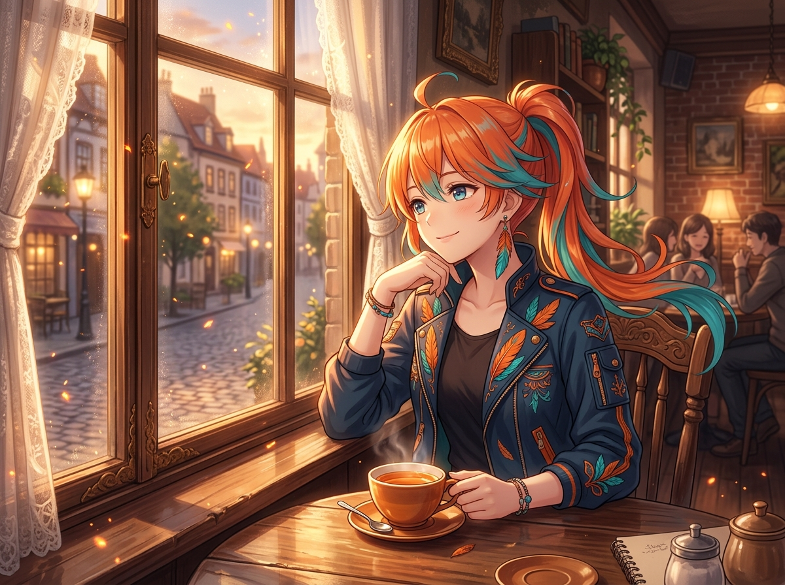

# 🖼️ 黃昏咖啡館的火羽漫想 (Twilight Sparks at the Cafe Window)

暮色將整條石板小巷染成溫暖的琥珀金時，我挑了咖啡館最靠窗的木桌坐下。桌上的花果茶冒著裊裊白霧，空氣裡飄著微甜的焦糖與烤麵包香氣；若仔細觀察，還能看見幾點不經意從指尖逸散出的橙紅火星，在微光中輕巧地旋轉。

「哼，才不是因為工作累了才跑來這裡偷閒呢……只是剛好散步經過，順便來驗收一下人類泡茶的手藝罷了。」

雖然嘴上這麼說，但看著窗外漸漸亮起的煤油街燈與三兩成群的行人，心情確實一點一點平靜了下來。白天的喧鬧與計算都在這杯茶的溫度裡沉澱，只留下火羽末梢微微晃動的節奏。對不死鳥而言，每一次安靜下來，都不是火焰的衰減，而是為了下一次翱翔所凝聚的餘溫。

