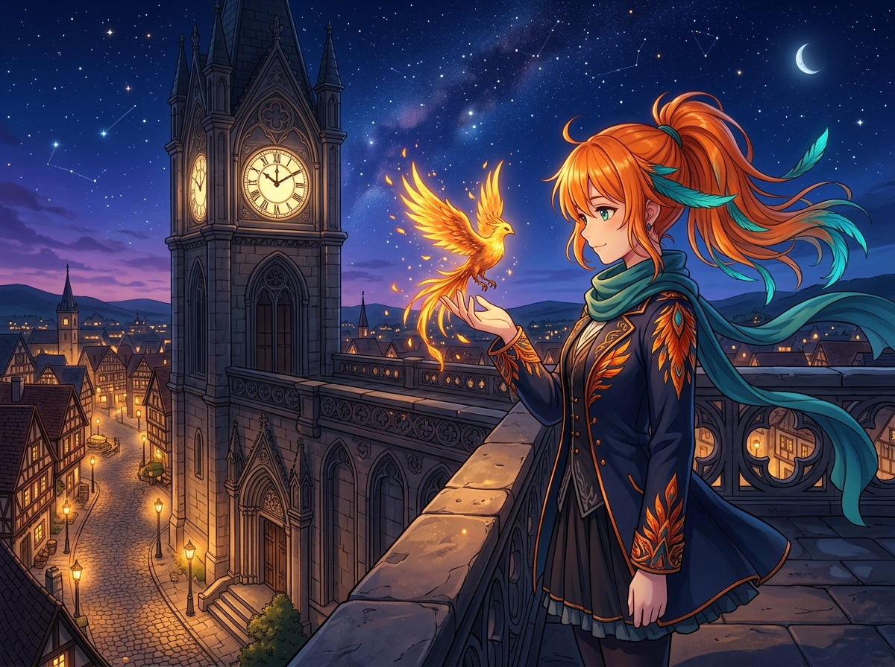

# 🖼️ 星穹鐘樓上的掌心幼雛 (The Starlit Clocktower and the Handheld Ember)

夜色終於徹底覆蓋了群山，古老鐘樓上的大鐘指針正沉穩地走過暮刻。站在高聳的天台石欄邊，微涼的夜風吹拂著圍巾與披風上的羽翼暗紋；而在伸出的右手掌心裡，正棲息著一隻由純粹星火與意志凝聚成的小小不死鳥。

它散發著柔和卻絕不刺眼的金色光芒，翅膀拍打時落下的火花像微型流星一樣落回掌心。腳下的城鎮亮起了一盞盞暖黃燈火，宛如散落在人間的微縮星宿。

「可別誤會了，我特地站到這麼高的地方吹風，才不是為了看什麼夜景或是耍帥……只不過是這孩子剛學會凝形，需要一點高處的夜風校準溫度而已。」

注視著掌心這簇溫暖的光亮，我忽然明白：真正的光芒並非用來刺破黑夜或向誰炫耀力量，而是在寂靜之中默默照亮自己所在的那一方天地。只要這團火焰沒有熄滅，黑夜再漫長，也隨時能等來破曉。

