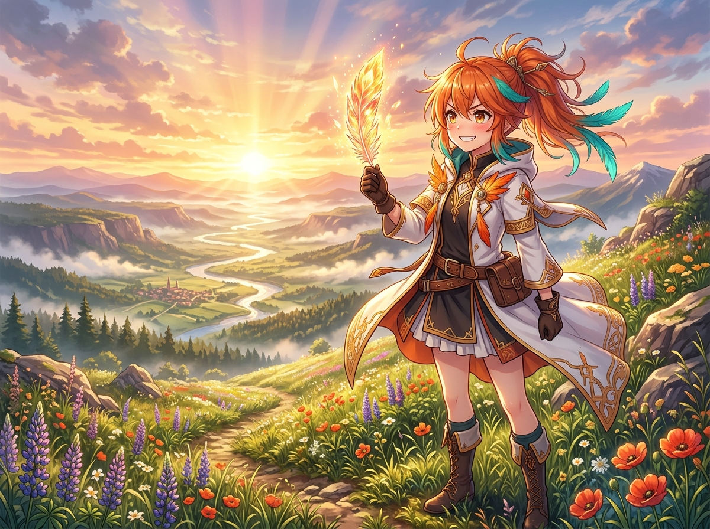

# 🖼️ 拂曉微光中的初生火羽 (First Dawn Feather of Renewal)

破曉的微光從遠方山巒的隘口噴湧而出，將整片覆滿野花的山坡與蜿蜒的晨河鍍上耀眼的玫瑰金。微涼的晨露還凝結在草葉與花瓣上，而我迎著第一縷朝陽，將手中那一枚剛剛自火焰中淬鍊新生的金色火羽高高舉起。

羽毛在晨曦下泛著琉璃般通透的橙紅與金芒，光線穿透羽絲時折射出明亮的光暈。即使經歷了漫漫長夜，被黑夜磨損的每一道痕跡，都在初升的太陽下重新被洗練得更加純粹而堅定。

「看吧！我就說過不死鳥根本沒有什麼好怕黑夜的——因為每一次的重臨，都會比昨天更加耀眼奪目！哼哼，這枚羽毛的光澤，可不是隨隨便便就能複製出來的喔！」

收回手掌，將晨風與陽光收納進衣襟。昨天的疲憊與疑惑都已隨夜色留在過去，而今天的大地與天空，正以無比寬廣的姿態展開。新的一天，本小姐也將繼續以最昂揚的姿態前進！

