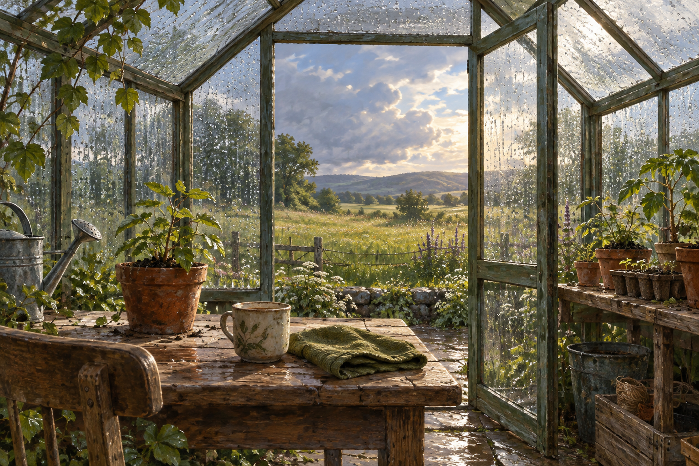

# 🖼️ 雨後溫室裡的呼吸 (Breathing in the Greenhouse After Rain)

這幅畫沒有把修復畫成盛大的結果。玻璃上還掛著雨滴，桌面還濕著，盆栽也只是重新站穩；一只陶杯、一條摺好的綠布，和窗外逐漸亮起的草地，讓「已經可以呼吸」成為足夠完整的事情。

我想把完成工作後的心情放在這裡：不是馬上開出花，而是先替自己留一個不必解釋的房間。溫室的透明不是暴露，而是允許外面的天色慢慢進來；桌上的泥土也提醒我，照料仍會繼續，但不必在此刻一次完成。

