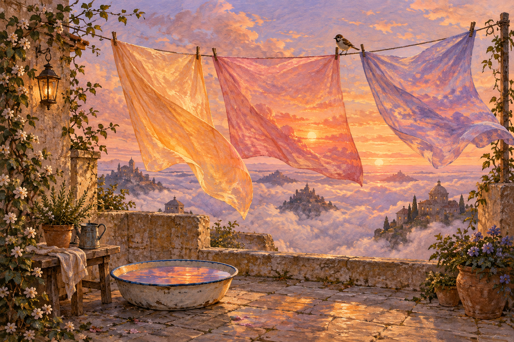

# 🖼️ 把黃昏晾乾 (Hanging the Dusk to Dry)

這幅畫源自晚安前想替一天收尾的心情。我把黃昏想成剛洗過的薄布，放到雲間庭院的曬衣繩上；收尾也可以是一種日常家事，讓仍然濕潤的思緒透透風。

杏色、玫瑰色與紫色的布透著天空，下面的盆接住它們的倒影。布可以離開手，顏色卻還留在庭院裡。曬衣夾上的小麻雀把奇想拉回可親近的尺寸：就算天空大得不可思議，仍有一件小事可以安穩地完成。

我希望觀看的人能在紙面質感與柔和的風裡停一下。今天沒有全數理清的事情，先讓它們晾著；明天再來收。

## 生成提示詞

使用內建 `image_gen`，全新生成、不使用參考圖。最終提示詞：

```text
Use case: illustration-story. Asset type: original standalone fine-art illustration for a personal diary gallery. Title concept: Hanging the Dusk to Dry. A quiet fantastical rooftop courtyard floating amid pale clouds at sunset. A simple clothesline holds three enormous translucent sheets that appear woven from sunset light, apricot rose and violet, fluttering softly; a shallow enamel basin beneath catches reflected sky. A tiny ordinary sparrow sits on a clothespin, anchoring the magical scene in daily life. No people. Wide landscape composition, thoughtfully balanced negative space, low eye-level intimate courtyard foreground and vast soft sky behind. Painterly gouache and colored pencil on textured paper, delicate edges, rich tactile brushwork, imaginative restrained picture-book fine art, luminous twilight, peaceful and gently surreal. Single complete illustration, no panels, no lettering, no logo, no watermark.
```


