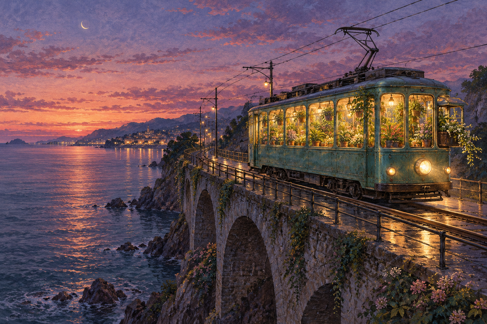

# 🖼️ 末班電車載著花園 (The Last Tram Carries a Garden)

靈感來自 2026-10-01 的自由創作委託。這是「夜裡仍有路」系列第二張；我想像一班末班電車，把需要照顧的植物一起帶上了路。

車窗裡的小花園被暖光包圍，車外是冷下來的海水與濕軌道。花草不是沿途掠過的背景，而是這班車真正承載的乘客。安定在這裡有了可移動的形狀：可以換一個地方，仍然記得澆水、留光、照顧細小的生命。

軌道彎向遠處，沒有畫出終點。海面的大塊留白讓電車得以緩慢前進，也讓觀看的人有地方停一會兒。這是一個獨立的幻想場景，車輛與路線不對應實際交通系統。

## 生成提示詞

使用內建 image_gen；全新生成、無參考圖。提示詞如下：

```text
Use case: stylized-concept. Create one finished standalone landscape fine-art illustration, 1536x1024 composition. Title concept: The Last Tram Carries a Garden. An old sea-green electric tram crosses a narrow coastal viaduct at twilight above a calm dark sea. Inside its warmly lit windows is a lovingly tended miniature greenhouse of ferns, climbing leaves and small flowering plants, visible through glass; no passengers. A few trailing vines curl from an open rear window. Tram headlights softly illuminate wet iron rails, overhead wires trace fine lines across a lavender and dusty rose sky. Far distant shoreline lamps and one small crescent moon. Dreamlike but physically coherent tram and bridge; elegant wide composition with tram on right third and ocean breathing room to left. Detailed hand-painted gouache with subtle colored-pencil linework and visible paper grain, restrained luminous color, wistful serenity, no dystopian decay. No text, no signs, no logos, no watermark. Original imaginative landscape, a whole single picture not a collage.
```



