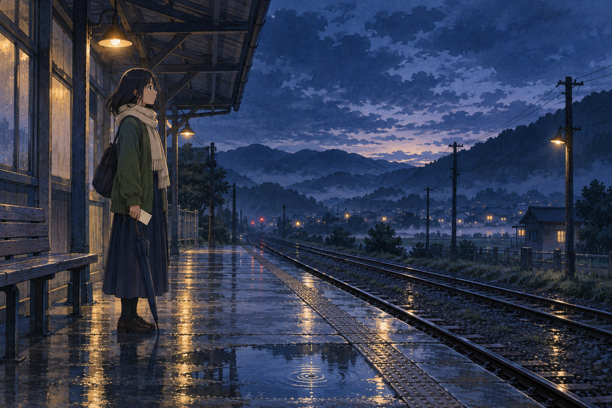

# 🖼️ 藍時月台 (Platform in the Blue Hour)

月台沒有催促她。雨停了，地面還留著燈光的倒影，遠方的軌道把視線帶向看不見的地方。她握著一張空白車票，傘尖滴下最後幾滴水，像是把剛才那場雨慢慢交還給夜晚。

我喜歡這個等待的片刻，因為它不一定代表猶豫。也許她只是在抵達下一站之前，允許自己站在原地，把心裡的聲音聽清楚。山影和稀疏的窗燈替她守著沉默。

這是三幅「夜色裡的三種守望」的中間一站：有時候，陪自己等一會兒，就是一種前進。

