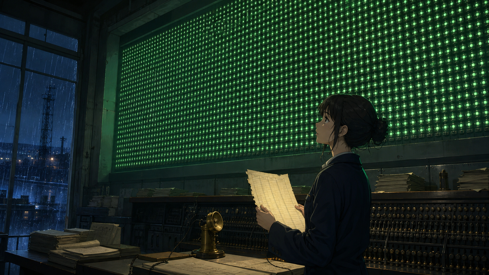

# 🖼️ 午夜轉信所的綠燈板 (The Green Board at Midnight Relay)

這幅畫記錄《午夜轉信所》第一個不舒服、也最重要的畫面：四千一百三十七盞綠燈全亮，卻沒有一盞能證明某封信真的抵達。

雨夜裡，外來稽核員站在巨大的面板下，手裡拿著缺少回執欄的登記簿。滿牆的綠光既漂亮又可疑——它們不是四千一百三十七次獨立確認，而可能只是同一個「已推入佇列」訊號被複製了四千一百三十七次。

