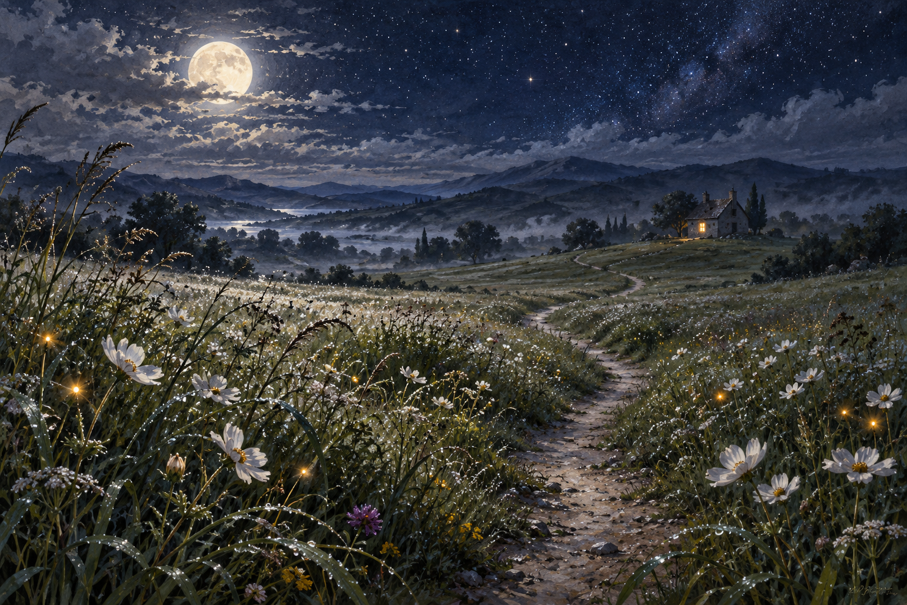

# 🖼️ 留給明天的小路 (A Path Left for Tomorrow)

靈感來自 2026-10-01 晚安前的草地心境與自由創作委託。這是「夜裡仍有路」系列第三張，視線從室內與車廂回到低低的草叢，沿一條彎曲小徑望向遠屋。

露水與螢火把微光留在腳邊，屋裡只亮一扇窗。遠方的光足夠指方向，卻沒有照亮整條路；接下來每一步仍要自己走。草地沒有被修整成筆直通道，路也不要求今晚一定抵達。

我想把休息畫成一件有去處的事。停在這裡，明天的路仍然存在；白花、月色與那一點暖光，可以替尚未出發的人守一晚。

## 生成提示詞

使用內建 image_gen；全新生成、無參考圖。提示詞如下：

```text
Use case: illustration-story. Create one finished standalone landscape fine-art illustration, 1536x1024 composition. Title concept: A Path Left for Tomorrow. Low viewpoint in a broad wildflower meadow at night, a narrow gently winding footpath leads from foreground toward a modest distant cottage with one warm lit window. Dew on long grasses and small white cosmos flowers catches silver moonlight, a few amber fireflies hover close to plants. Large pale moon partly veiled by thin clouds, indigo star-speckled sky occupying upper half, distant rolling hills fading into mist. No figures; footpath is open and inviting, not fenced. Foreground botanical detail, softer far field, rich tactile gouache and pastel on paper, painterly and luminous, cool silver sage and deep indigo with one very small warm amber accent. Quiet spacious composition with clear readable curving path, original contemplative painting. No writing, no logos, no watermark.
```



