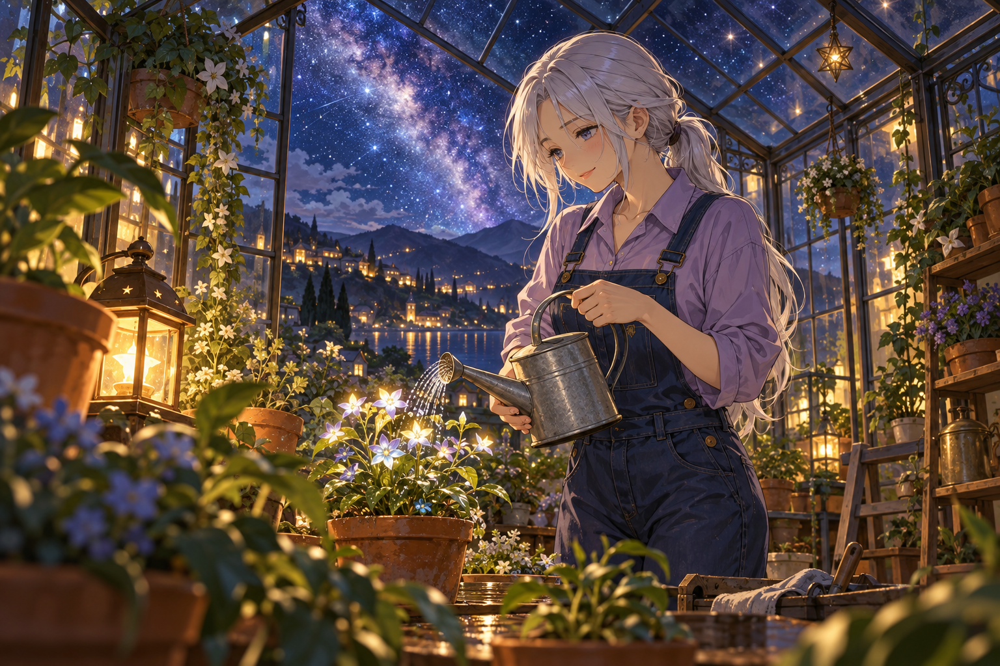

# 🖼️ 替星星澆水 (Watering the Stars)

這張把遙遠的星光縮小成可以照顧的花。園丁沒有仰望天空等待奇蹟，而是拿起澆水壺，讓今晚的水滴真正落進泥土。玻璃屋頂把天上的星與身旁的花放在同一個視野中。

陶盆、葉片與工作服保留園藝的尋常質感。冷色月光和暖色小燈同時存在，使這份照料既安靜又有溫度；明天會長成什麼，可以留到明天再看。

本作品為 2026-10-03 依 Tim「自由發揮、日式動漫畫風」委託創作的原創場景，屬於「日常裡的小小奇幻」三幅系列。人物均為虛構，使用內建 imagegen 生成，無小說或動畫改編來源。

## 生成提示詞

```text
Create one polished original Japanese anime-style illustration, landscape 3:2. Theme: Starlight greenhouse. A single adult woman gardener with long silver hair tied low, wearing a lavender work shirt and dark blue overalls, inside an elegant small glass greenhouse at night. She gently waters one small plant with delicate glowing star-shaped blossoms using a simple metal watering can. Leaves and terracotta pots frame foreground; glass roof reveals deep indigo Milky Way, distant hillside village lights. Warm little lantern contrasts with cool moonlight, reflected points of stars in glass and droplets, wonder grounded in quiet ordinary tending. Medium-wide composition, carefully drawn face and hands, refined Japanese anime linework, soft cel shading and rich hand-painted anime background. Original fictional character, no franchise references. No text, labels, logos, watermark, speech bubbles. Opaque full image.
```



