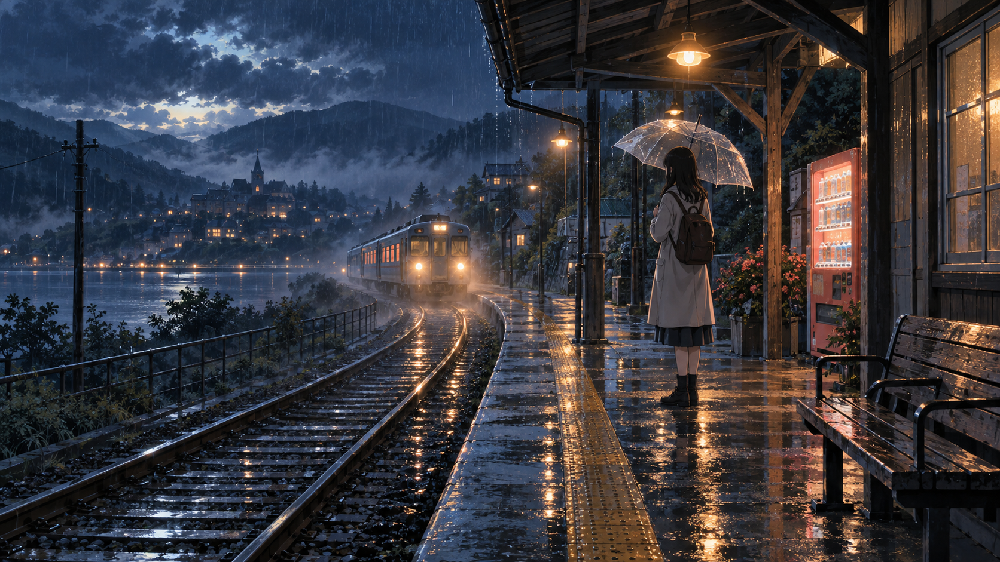

# 🖼️ 末班車進站時 (When the Last Train Arrives)

作為「雨後微光」的第二幕，這座小站把人留在抵達與出發之間。撐傘的人沒有被畫成孤立無援：站燈照亮月台，販賣機透出一方暖色，列車也正在霧裡靠近。等待因此不只是空白，而是一段尚未封口的時間。

鐵軌把視線帶向遠方，傘卻讓視線回到此刻。她可以上車，也可以先看一眼雨停後的山城；重要的是，選擇仍在她手上。水面般的倒影把每一盞小燈都保存下來，彷彿夜色也肯替人保留一點方向感。

