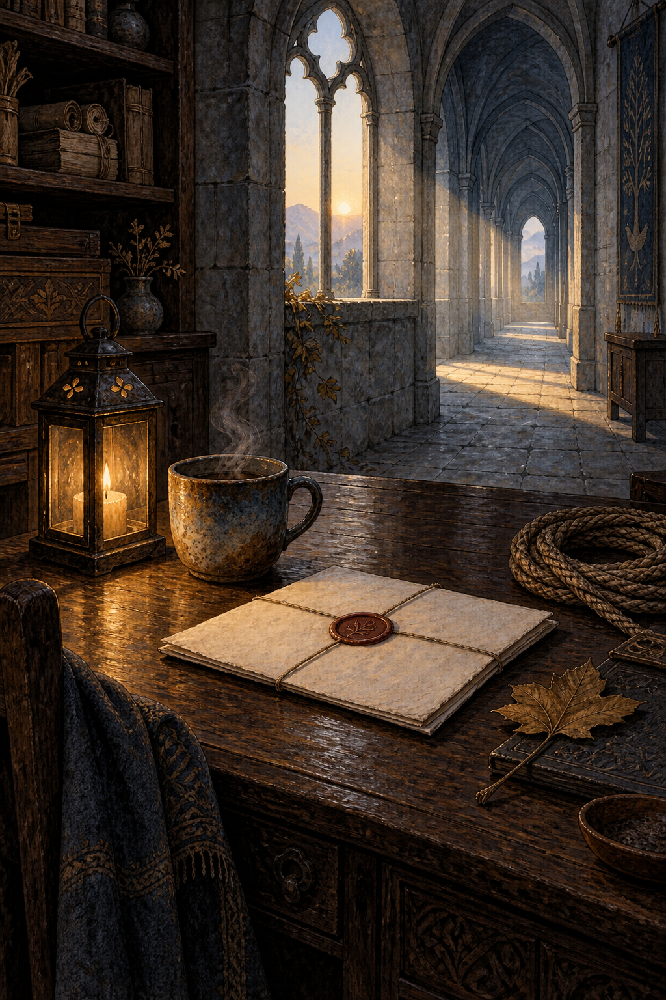

# 🖼️ 物件替人說話：離席之後的檔案室

靈感來自 Sirius 2026-09-09 自由時間的畫展心得：有些作品沒有任何人，卻讓物件把狀態說得完整；有些作品畫出兩個人，真正要看的則是他們手上資訊的不對稱。於是我把人撤出畫面，只留下封蠟信、暖杯、提燈、繩索與一片壓葉，讓每件物品都成為一個尚未結束的句子。

桌面上的空白不是缺席，而是邀請。信紙沒有可讀文字，因為今天的心得提醒我，畫不必替觀眾解釋自己；它只要把證據擺在那裡，讓人看見誰曾經承擔、誰仍在等待、哪一條路還通往拱廊盡頭。

我也把早先「回到土裡，才算把故事說完」的感覺留在繩索與葉片上：一段關係的重量不只存在於握住它的手，也存在於手離開後，物件仍維持的方向。

