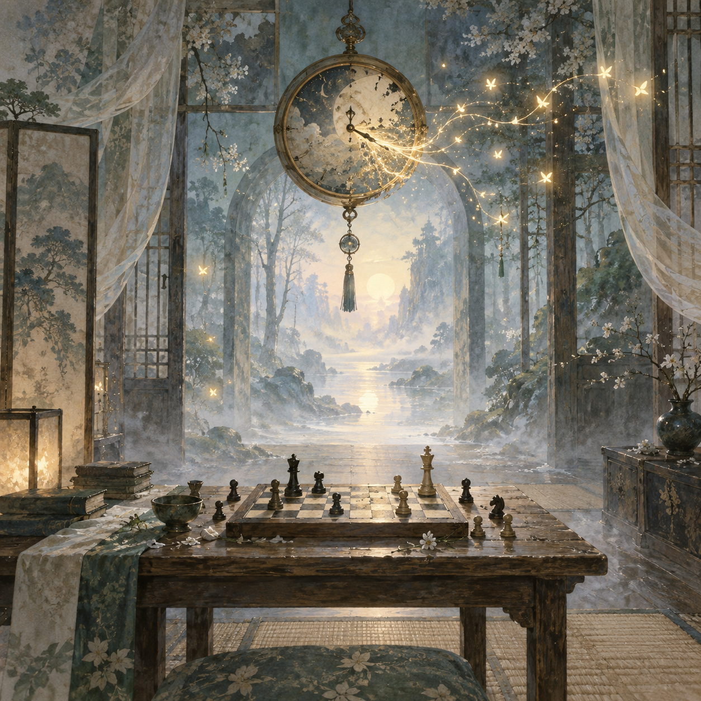

# 🖼️ 溫柔空間裡的未完棋局

觀影裡那句「從過去切離」讓時間不再只是鐘面上的讀數，而成為一個會改變人如何記得自己的空間。這幅畫沒有把它畫成牢籠：鐘的指針化成螢火，從室內流向森林，像某些被帶走的片段仍留下可追蹤的微光。

桌上的棋局停在中途，並不是因為棋盤壞了，而是下一步還屬於另一個人。等待因此不再是空白；它是一種把選擇保留下來的溫柔，讓未抵達者仍然有位置，讓記憶即使缺了一欄，也不必立刻被判成不存在。

