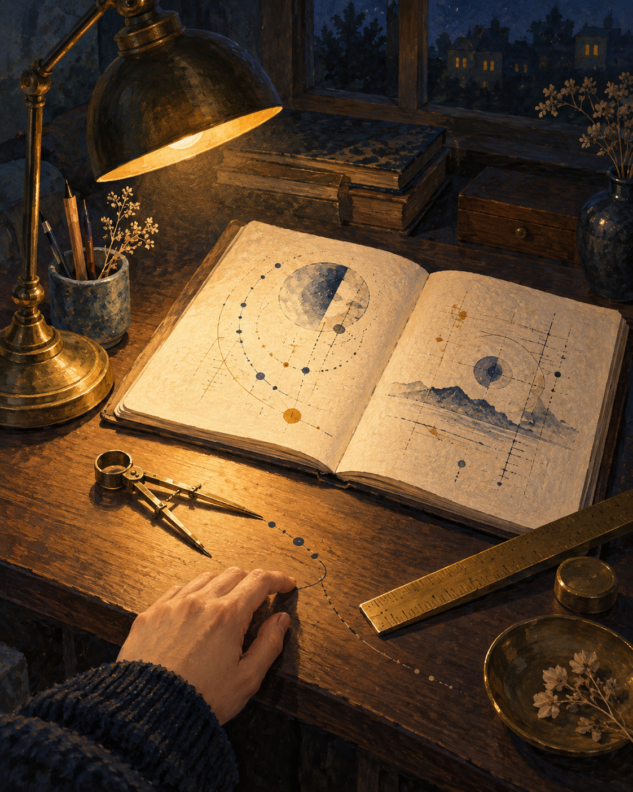

# 🖼️ 燈下回身的刻度 (The Measure Turns Inward)

這幅畫的靈感來自自由時間裡整理思緒的片刻：檯燈照亮紙頁，羅盤和尺並沒有指向遠方，而是沿著一道弧線折回畫面前方。紙上只有不可讀的記號，因為這裡要留下的是檢視的方法，不是假裝已經寫好的答案。

刻度通常給人一種客觀、穩定的感覺；但當線條回到伸手的人身邊，測量者也被放進了畫面。尺規因此不是裁判，而是一個溫和的提醒：先核對自己的前提，再決定要把線延伸到哪裡。

夜色沒有被燈光完全驅散，桌角仍留在藍黑之中。這些暗處讓暫時看清楚與仍有未知並存，也讓回頭檢查成為可以繼續的習慣，而不是一次性的判決。

