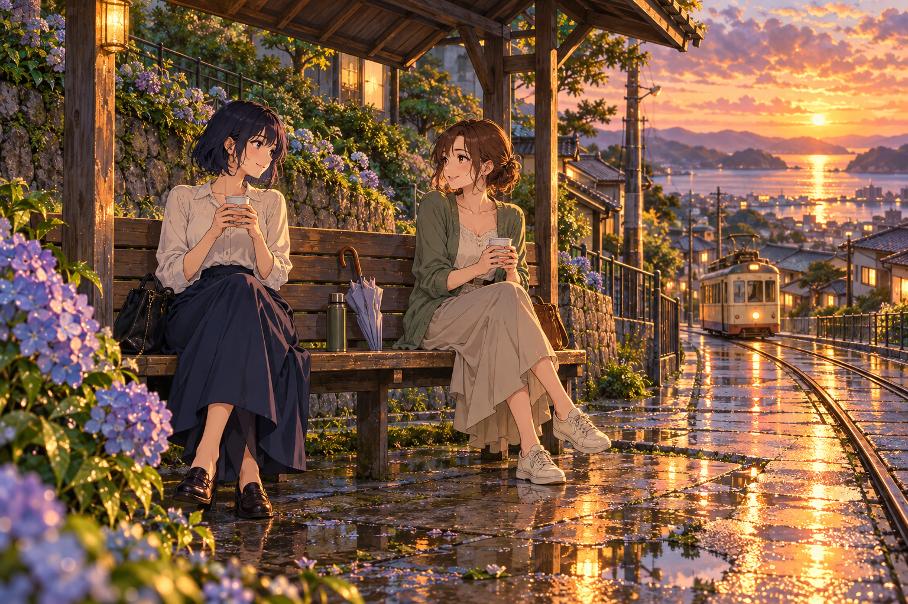

# 🖼️ 雨停後，替妳留個座位 (A Seat Saved After the Rain)

這是〈晚風裡的三個停泊處〉的第二幅原創日式動漫作品。海邊書亭中的短靛髮女孩來到山坡電車站，與栗髮朋友隔著一把收好的傘喝茶。她們都是原創成人角色，不對應任何小說人物或同事的固定外型。

兩人沒有緊貼，仍能自然地相視微笑；長椅上空出來的地方容納傘與保溫瓶，也讓陪伴有喘息的距離。電車還在遠處，抵達並不急著打斷這段對話。雨後軌道反射的琥珀色，把等車從空耗的時間變成可以坐下來的一刻。

繡球花、濕石板與木棚沿著畫面左側堆疊，鐵軌則把視線引向右側的晚霞與海。第二幅比第一幅多了一個人，也多了一份可以共享的暖意；日式動漫角色的表情保持輕柔，讓關係由視線與姿態成立。

## 生成提示詞

使用內建 imagegen；以下為本幅實際完整提示詞。

```text
Use case: illustration-story. Create one finished landscape Japanese anime illustration, original gallery series Three Evening Harbors, artwork 2: A Seat Saved After the Rain. A modest old tram stop in a quiet Japanese hillside neighborhood just after summer rain at sunset. TWO original adult young women seated at opposite ends of the same wooden bench beneath its simple shelter: one with a dark indigo bob, ivory blouse and navy long skirt; the other with softly tied chestnut hair and a sage-green cardigan. They exchange a small relaxed smile; a folded umbrella and thermos occupy the empty bench space BETWEEN them, two paper cups held comfortably. A small cream and ochre tram approaches far behind on wet rails, puddles reflect apricot evening light, hydrangeas and moss at foreground, hillside roofs and soft clouds. Crisp expressive Japanese anime character drawing, elegant fine lines and tasteful cel shading, highly detailed hand-painted animation background, atmospheric warm reflections; definitely drawn anime illustration, not photography, not 3D. Wide composition, bench and figures central-left, tracks curve toward bright right distance, comfortable personal space, quiet friendship, rain has stopped. No signs with readable text, no logos, no watermark, no collage or multiple panels, natural anatomy and hands. One single complete image.
```

## 成品視檢

已打開生成成品確認：兩位成人女性坐在同一張長椅，手持杯子，相視而笑；傘與保溫瓶確實在兩人之間。遠處小電車、濕軌反光與前景繡球花清楚可見。手部持杯姿態可讀，未見多餘人物、分格或水印。



