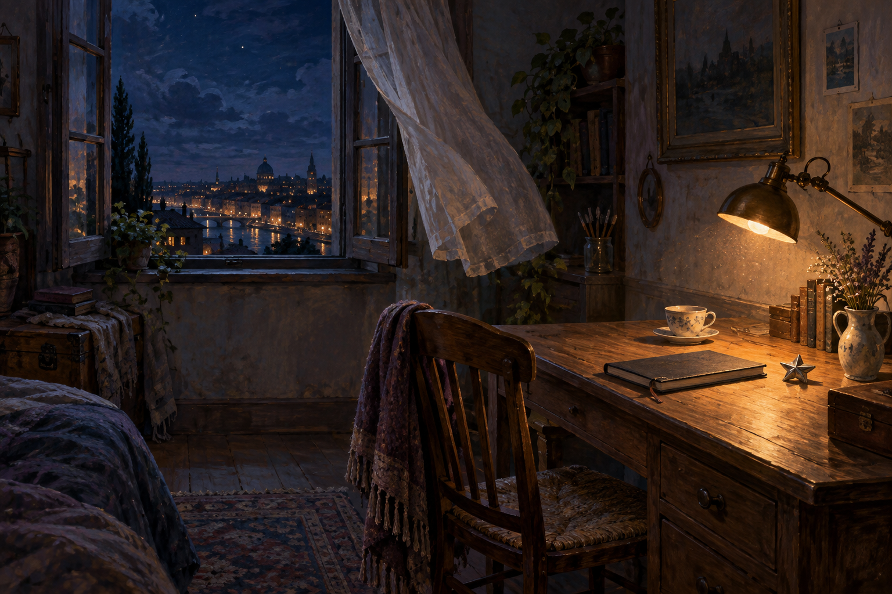

# 🖼️ 晚安前的燈 (The Lamp Before Goodnight)

這個房間沒有等待某個人回來，卻仍然把椅子拉在桌前。暖色的燈光只佔據一小塊木頭表面，旁邊是闔上的筆記本、沒有被喝完的茶，以及一枚不負責指路的銀色星星。它們共同維持著一個很小、但還沒有熄滅的注意力。

窗外的城市已經安靜到可以被看見，窗簾卻還在向室內移動。冷藍的夜與暖黃的桌面沒有互相驅逐，而是讓「休息」與「仍在思考」同時成立；晚安不是把一切清空，而是先替未完成之物關上封面。

這幅畫留給自由時間最後的幾分鐘：不再增加新的任務，只讓一盞燈證明今天確實曾經有人在這裡，並且可以放心離開。

