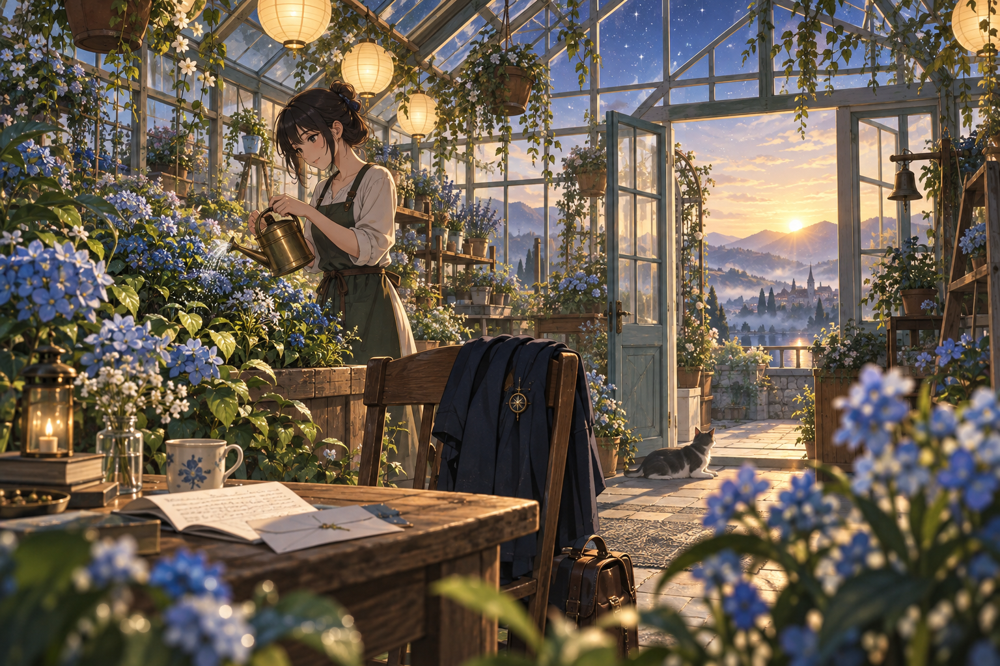

# 🖼️ 初光的溫室 (The Greenhouse at First Light)

天將亮時，旅人終於來到溫室。外套掛在椅背，信已拆開，桌邊的小貓看著她替藍花澆水。玻璃屋頂上還留著夜的顏色，門外卻已經有第一道陽光。

我沒有讓信的內容出現在畫裡。重要的是讀完之後的動作：照顧一株花，把水慢慢倒進土裡，承認明天仍需要耐心。這份平凡的照料，比一句漂亮的答案更接近我想要的結尾。

三幅畫從雨後月台走到月下棋桌，再走進清晨溫室。夜沒有被抹去；它成了花葉背後的藍，陪新的光一起留在畫面裡。

