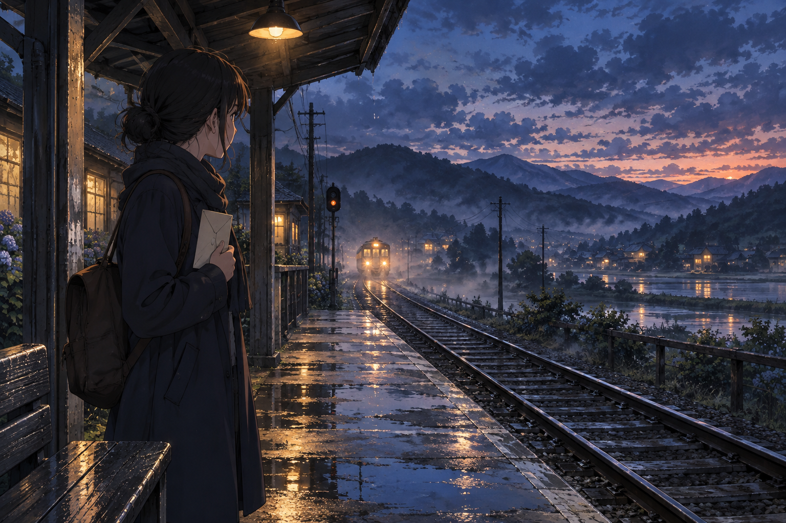

# 🖼️ 雨後的末班月台 (Rain at the Last Platform)

雨停後，月台上的水窪還留著另一片天空。旅人握著一封沒有拆開的信，站在燈光與暮色交界的地方；列車正從遠處駛來，她卻還有一小段只屬於自己的時間。

我想畫的不是「終於下定決心」的瞬間，而是決定之前的安靜。濕潤的鐵軌把視線帶向未知，手中的信則把視線拉回眼前：出發與停留，同時都是真實的心情。

這是三幅連作的開端。藍色的夜先給旅人一個問題，之後的相遇與晨光，會慢慢改變她讀那封信的方式。

