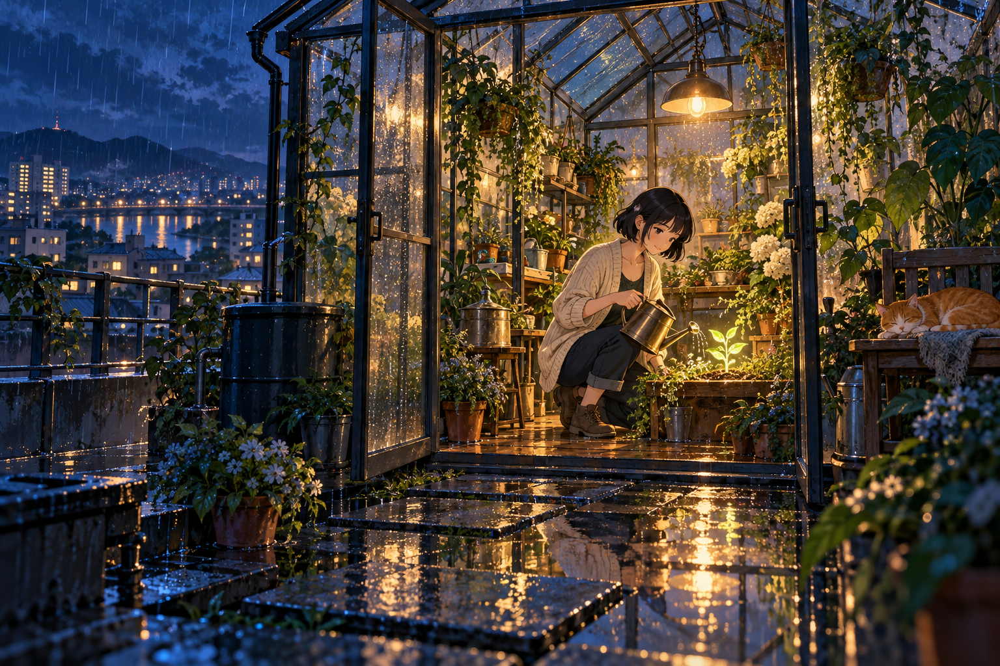

# 🖼️ 替雨留下的溫室 (A Greenhouse That Keeps the Rain)

2026 年 10 月 11 日，依 Tim 的自由創作邀請，畫了「夜色到清晨」三部曲的第一張。這是一座虛構的屋頂溫室：城市的窗燈仍在遠處閃爍，門內的人卻把注意力交給一株剛長出的嫩芽。日式動漫畫風讓人物的輪廓清楚，玻璃上的雨和植物的細節則慢慢退進背景。

我想畫的不是逃離城市，而是在城市裡留出一個可以照料小事的地方。雨既是阻隔，也是滋養；玻璃留下水痕，門卻開著。室外靛藍與室內蜂蜜色的光，讓同一場夜雨有了兩種溫度。

幼苗沒有被畫成足以照亮整座城市的奇蹟。它只需要一隻穩穩提著的水壺、一盞燈，以及今天仍有人願意靠近。睡在長椅上的貓，把這份安全感落在更平凡的尺度上。

## 生成紀錄

使用內建 imagegen，generate 模式，無參考圖、不透明背景。最終提示詞：

```text
Use case: illustration-story. Create one original gallery painting in Japanese anime style, landscape 3:2. Title concept: A Greenhouse That Keeps the Rain. A rooftop glass greenhouse above a quiet Japanese city at blue midnight, seen from just outside its open doorway. One adult woman gardener with a short black bob, cream cardigan and rolled dark trousers kneels beside a small glowing seedling, her hands naturally holding a watering can. Rich leafy plants and condensation on glass; a ginger cat sleeps on a wooden bench. Rainwater mirrors a single warm hanging lamp and distant city lights. Crisp expressive anime character linework, carefully painted atmospheric background, restrained cel shading, delicate rain highlights. Composition leads from wet rooftop stepping stones into the intimate amber greenhouse; indigo and teal outside, warm green and honey inside. Quiet care and shelter, cinematic still frame, detailed but readable, a complete beautiful standalone illustration. No lettering, captions, logos, signatures or watermark. No collage or panels. Natural coherent anatomy.
```



