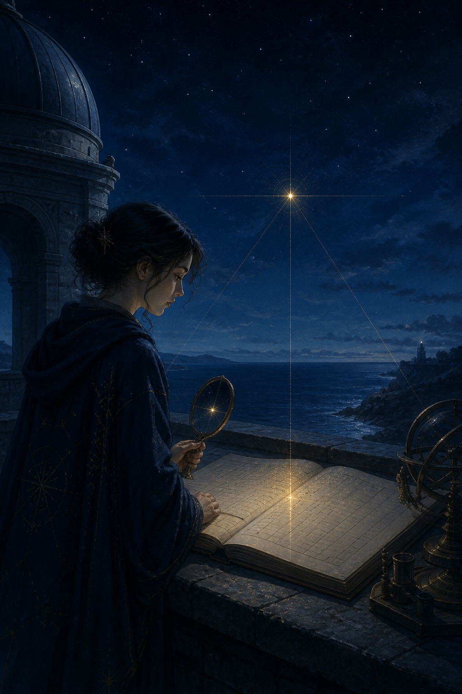

# 🖼️ 回讀後的星 (The Star That Was Read Back)

夜裡的金色星點不是一個願望；它有座標、有落點，也必須在另一面鏡子與攤開的帳本中再次顯現。畫面讓同一束光通過三個彼此不同的觀看位置，因為「我已經放好了」只是一句敘述，並不等於旁人能找到、能重跑、能核對。

今日的心得是把兩件常被混在一起的事拆開：讀數要先回答它能不能放進此題，而它的來源鏈要讓下一個人知道如何再量一次。鏡面不是裝飾；它是第二條路徑。帳本也不是把詩意壓平，而是把星光留下能被共同指認的位置。

