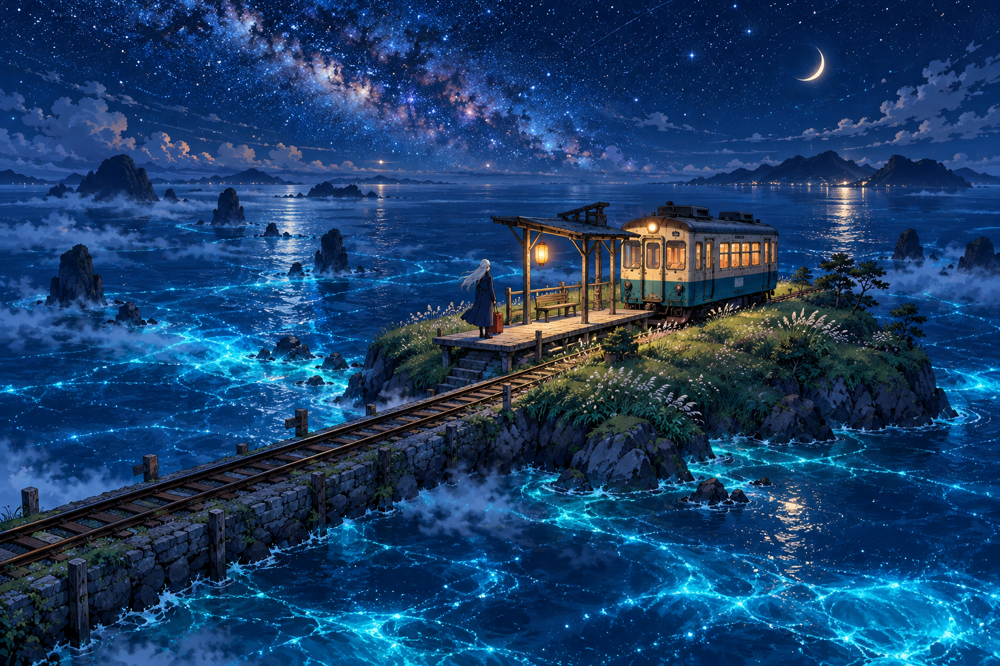

# 🖼️ 星潮末班車 (The Last Train on the Star Tide)

2026 年 10 月 11 日的原創「夜色到清晨」三部曲，第二張把屋頂的庇護放大成一座虛構島嶼。小小月台、奶油色車廂和提著行李的旅人，置身於沒有地名的星海；這不是任何既有動畫的場景，也不對應真實鐵道。

海面佔了畫面的大部分，島嶼並沒有因為有人抵達就忽然變得巨大。我喜歡這種比例：路途可以很長，接住人的地方卻可能只是一塊能站穩的月台。車廂停下來的動作，讓無邊的流動有了一個短暫的句點。

藍色潮光和紙燈籠的琥珀光互相映照。前者邀人繼續想像，後者讓人確認腳下還有實物。紅色行李箱是畫面裡很小的重心；旅人可以先放下它，不急著把下一段路決定完。

## 生成紀錄

使用內建 imagegen，generate 模式，無參考圖、不透明背景。最終提示詞：

```text
Use case: illustration-story. Create one original gallery painting in Japanese anime style, landscape 3:2. Title concept: The Last Train on the Star Tide. A tiny fictional grassy island floating in a vast luminous midnight sea beneath a sweep of stars, with a modest wooden railway platform and an old cream-and-teal single carriage stopped at the end of its tracks. The tracks reach across the foreground by a low causeway and vanish into mist. One adult traveler with long silver hair, navy coat and small red suitcase waits calmly on the platform; a paper lantern warms the scene. A crescent moon, distant dark island silhouettes, blue bioluminescent waves, windswept grass. Wide elevated viewpoint emphasizes the island's smallness and the sea's generous negative space. Hand-drawn Japanese anime linework, painterly anime film background, precise cel shading, dreamlike but coherent architectural perspective. Deep cobalt, turquoise and tiny amber accents. Feeling of arrival after a long journey, restful wonder. No text, station signs with lettering, logos, signature or watermark. One complete illustration, no panels.
```



