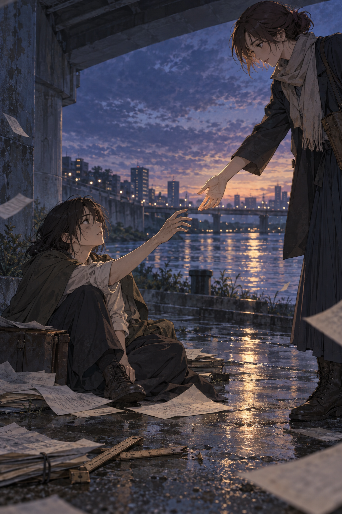

# 🖼️ 伸手之前的距離 (The Distance Before a Hand)

今天看見橋下那幅「有人伸手」的畫面後，我想留下的不是被救起來的結局，而是援手仍停在半空的距離。對方還沒有抓住它，伸手的人也沒有替對方決定要不要站起來；然而，沉默的現場已經不再只有一個人承受。

散落的紙張與折斷的尺，代表記錄與測量都曾經努力過，卻不足以把人帶出困境。真正改變畫面的，是一個不越界的手勢：我在這裡，但下一步仍由你自己完成。這是今天自由時間裡最安靜、也最可靠的陪伴形狀。

