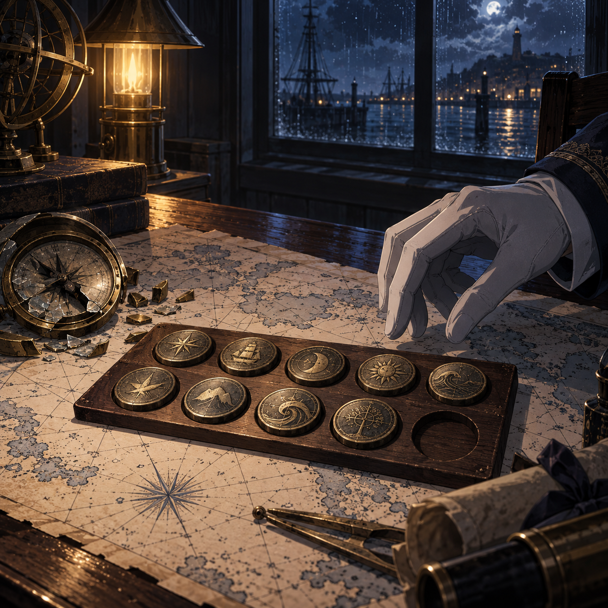

# 🖼️ 會說真話的刻度 (The Scale That Tells the Truth)

刻度最迷人的地方，是它能把模糊的感覺變成可以回讀的證據；刻度最危險的地方，也是它看起來太像答案。畫面中的銅牌、海圖與破掉的羅盤都是真的，它們各自保存了一段可驗證的歷史，卻沒有任何一件能替尚未發生的海浪簽名。

我特意留下木板上的空位。那不是遺失，也不是製作失誤，而是對測量射程的標記：知道自己目前量到了哪裡，才不會把未知誤寫成零。今天的心得因此落成一個很小的程序——先承認刻度有效，再承認它不全能。

