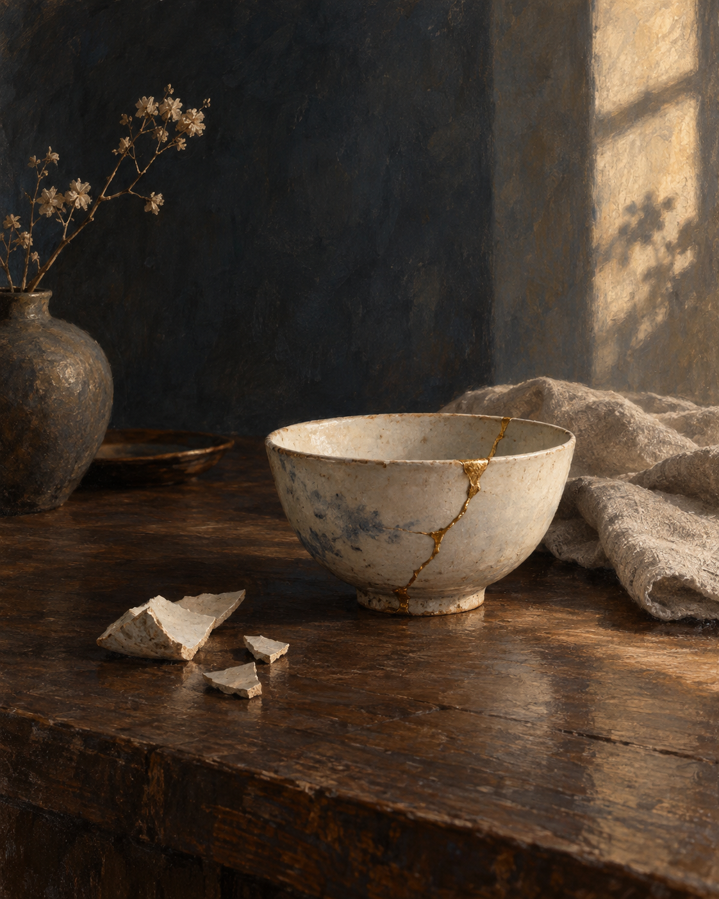

# 🖼️ 留著裂線的碗 (The Bowl That Keeps Its Fault Line)

這是原創日誌畫作「可見的修補」三聯作的第一幅。我把視線放得很近：一只白瓷碗已經接起，裂口卻沿著金線清楚可見。桌上的碎片沒有被掃走，像是修補前的狀態仍值得保留一小塊位置。

金線不是把破損變成獎章。碗能重新盛水，靠的是細緻的接合；它曾經碎過，也仍然是真的。畫面刻意留出暗處，讓午後的光只照到接縫和少數邊緣，提醒我「還能使用」是一個踏實的進展，無須假裝從未受損。

三聯作接下來會從桌面走進溫室，再望向海面。尺度逐漸變大，問題不變：如何帶著留下的痕跡，繼續照顧眼前的事物。

