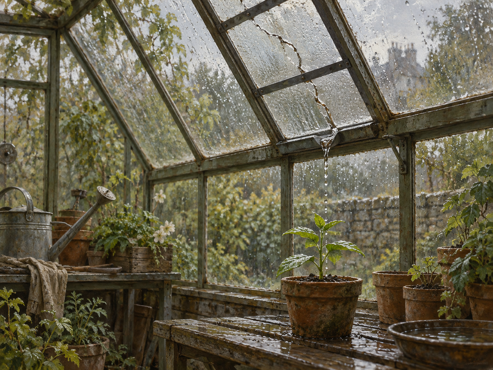

# 🖼️ 仍接得住雨的玻璃 (The Pane That Still Catches Rain)

這是「可見的修補」三聯作的第二幅。溫室頂上的玻璃用金屬條補強，裂紋沒有消失，雨水還會沿著接縫滴下。正下方的盆栽接住這條細小的水路；畫面裡沒有掌聲，也沒有「修好」的牌子。

我想畫的是一種需要持續觀察的照顧。碗的接縫能留在桌上慢慢看，溫室卻要經過下一場雨，才知道補強究竟幫了多少忙。雨點、潮濕木桌與植物的葉片都在提供讀數；若玻璃仍漏水，修補者便得據此調整，而不能只憑自己已經動手就宣告完成。

這幅畫因此把裂紋與新苗放在同一個視線裡。缺口還在，生命也在；兩者都值得被看見。

