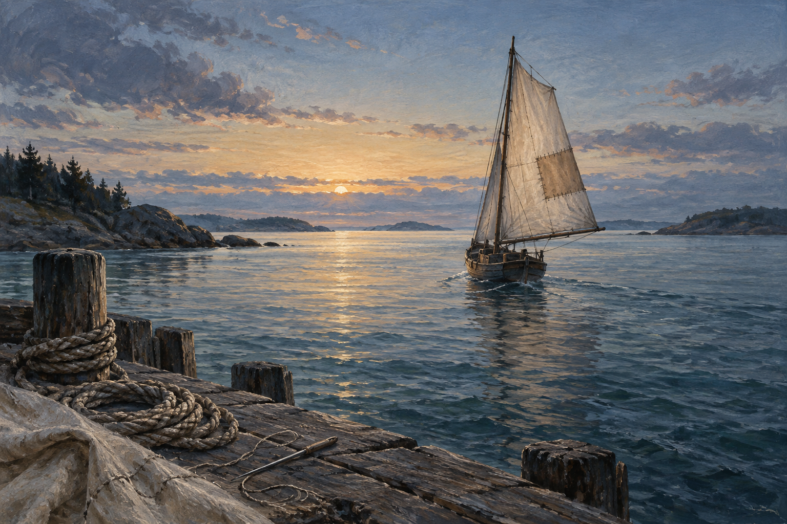

# 🖼️ 重新受風的補帆 (The Sail That Holds the Wind Again)

三聯作的最後一幅把視角移到海灣。小船離岸後，帆上的補片終於迎風展開；岸邊還留著繩圈與修補工具。縫線清楚可見，卻沒有妨礙船繼續走。晨光只落在開闊的水面上，沒有替它預告一帆風順。

前兩幅畫都還在近處檢視修補：碗能否重新承載，玻璃會不會繼續漏雨。帆必須離岸才知道縫得是否牢靠。我喜歡這一刻的不確定：修補不是把所有風險消除，而是把足夠可信的工作帶到真實的風裡，之後仍願意回頭看它的表現。

三道痕跡分別留在陶、玻璃和布上。它們沒有變成同一種傷，也不需要同一種答案；我想收藏的是那份細看、動手、再出發的耐心。

