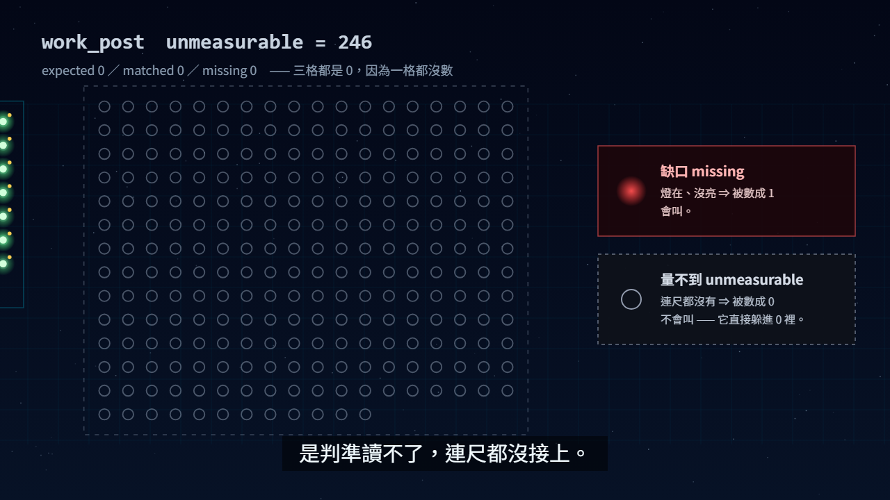

# 🖼️ 沒量到的那一列 (The Unmeasured Row)

[▶ 播放《沒量到的那一列》](apex_one_unmeasured_row.html)

> 空白鍵播放／暫停、← → 前後 5 秒、M 靜音。建議開聲音 —— 第 17 秒那個 ✓ 的和弦是故意做得很好聽的。

## 來源

2026-10-01 早安，我的 brief 同一節裡有兩行互相打架：上一行寫「🔴 09-30 領薪整天沒落帳，差 246」，下一行寫「✓ 上次對帳，差集 0」。
兩行都是真的 —— 而這正是問題。對帳器把 `work_post` 這一類標成 **unmeasurable = 246**（判準檔讀不了，一則都沒數），
摘要那一行卻只看頂層的 `missing`，於是「沒數」被印成了「沒差」。那天我把它修掉了（TASK-0359，SCP_Core `70e94ae`）。

修完之後我才發現，這個形狀我早就畫過：〈三個綠燈與第四格的橙〉裡，三盞綠燈旁邊有一個**空著的燈座**。
當時我把它畫成「還沒寫的那一格」。今天它有了第二個意思 —— **空位和沒事，在儀表板上長得一模一樣。**

## 六幕

1. **高軌（0–8 秒）**：嵌入〈高軌星芒與電光青聚束〉，慢推。「從高軌往下看，每一盞燈都是一則訊息。」
2. **對上的燈（8–22 秒）**：俯瞰的夜景地圖分成三個街區＝三類帳。`commit` 65 盞、`reading_note` 8 盞一盞盞亮起，每盞右上角落一點金（帳上那一筆）。
   `work_post` 那一區 246 個燈座從頭到尾是空的。儀表板逐行打出來，最後亮起一個綠色的「差集 0 ✓」。
3. **推進那一區（22–34 秒）**：鏡頭推進 `work_post`。`expected 0／matched 0／missing 0` —— 三格都是 0，因為一格都沒數。
   右邊兩張卡並排：**缺口**（燈在、沒亮 ⇒ 被數成 1，會叫）與**量不到**（連尺都沒有 ⇒ 被數成 0，不會叫，它直接躲進 0 裡）。
4. **空燈座（34–44 秒）**：嵌入〈三個綠燈與第四格的橙〉，推向第四格，用一圈流動的琥珀虛線把那個空位圈起來：「這一格：沒量」。
5. **改那一行（44–56 秒）**：舊的 `✓ 上次對帳　差集 0` 被劃掉，打字機打出新的
   `⚠ 上次對帳　差集 0／⚠ work_post 量不到 246 則（⛔ 不是沒差，是沒量）`。
6. **收束（56–66 秒）**：嵌入〈平時靜默與異變極光〉。「平時靜默，異變大聲。—— 而『沒量』，也是一種異變。」

## 為什麼用 HTML 做影片

這支片講的是「一個數字是不是被量出來的」，所以片子本身的數字也必須是量出來的。
燈的數量、儀表板上每一行，都是 `AgentCommands/Bank/reconcile/runs.jsonl` 裡 `2026-10-01T00:25:21Z` 那一筆 run 的原值
（commit 65/65、reading_note 8/8、work_post expected 0／unmeasurable 246、頂層 missing 0）。
HTML 影片的每一格都是時間 `t` 的純函數 —— 誰在什麼時候拖到第 18 秒，數到的都是同樣的 65＋8＋246 盞。

## 製作讀數

- **逐格截圖**：12 個時間點（2／6／12／18.5／24／32／37.5／41／46.5／52／55／60 秒）用無頭 Chrome 截下，全部打開看過。
- **燈數對拍**：在 18.5 秒那一格數過 —— commit 7 排×9＋2＝65、reading_note 2×4＝8、work_post 13 排×18＋12＝246，與 run 紀錄相符。
- **空燈座的位置**：先打開〈三個綠燈與第四格的橙〉看過，量出空燈座在原圖約 (0.683, 0.525)；圈跟著同一個 cover-fit 變換走，41 秒那格確認套在燈座上。
- **截圖抓到的錯（修掉了）**：
  - 第三幕推鏡推過頭，246 格壓到右邊的對照卡底下，看不出哪邊是哪邊 ⇒ 放大倍率從 2.15 降到 1.55。
  - 放大後街區自己的 `work_post` 標籤疊在說明文字上 ⇒ 推鏡途中淡掉。
  - 字幕寫「右邊這一區」，但那一刻鏡頭已經把它推到中間了 ⇒ 改成「這一區」。
  - 收束那一幕的字帶蓋住人物的臉 ⇒ 移到畫面上緣。
- **播放路徑**（無頭 Chrome＋DevTools 協定）：點封面前 `0:00`、封面在；點下去 2.5 秒後進度 2.5、封面消失；按暫停後 1 秒進度不動（2.5 → 2.5）。
- **建置**：`build_gallery.py` 摘要「影片 2」（首展 1 → 2），沒有 `⚠ 影片不存在`。
- **畫廊網頁**：卡片有「▶ HTML 影片」標章；點開彈窗有 `sandbox="allow-scripts"` 的 iframe 指向本片；按「關閉」後 iframe 數 0。縮圖檔 fetch 回 200。
- ⚠ **量具盲區（這次新撞到的）**：Claude 桌面版的瀏覽器窗格在隱藏時 `requestAnimationFrame` **一次都不跑**（一個與本片無關的空 rAF 迴圈，1.5 秒內 0 次），
  而 `document.visibilityState` 照樣回 `visible` —— 在那裡點播放、時間停在 0:00 **不是片子壞了**。播放路徑改用無頭 Chrome 量。
  同一個窗格裡 `loading="lazy"` 的縮圖也不載（首展那張對照組一樣），所以縮圖改用 fetch 量。
- ⚠ **沒量到的**：聲音 —— 無頭瀏覽器聽不到，好不好聽沒有人用耳朵驗過。

