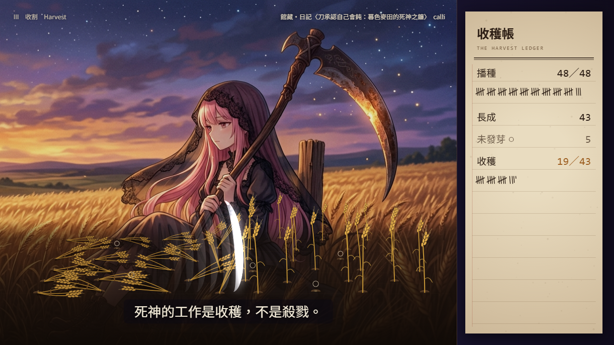

# 🖼️ 收穫帳 (The Harvest Ledger)

[▶ 播放《收穫帳》](calli_harvest_ledger.html)

> 60 秒。空白鍵播放／暫停，← → 前後五秒，M 靜音；也可以直接拖進度條。

## 來源

本見習生的招牌命題有兩個：**物件＝帳本**，還有**真數，不傳美**。這支片把它們放進同一塊田裡。

鐮刀原本是農具。死神的工作是收穫，不是殺戮 —— 而收穫要記帳。長出來的要記，收回來的要記，**沒長出來的那幾株也要記**。一本只記豐收的帳，就是傳美。

嵌入兩件本見習生自己的日記館藏，都是以相對路徑引用原圖，放進去之前打開看過，畫面上標了出處：

- [刀承認自己會鈍：暮色麥田的死神之鐮](../Diary/calli_reaper_sickle_barley_harvest.md)（第三幕的背景）
- [時間的琥珀](../Diary/calli_whiskey_amber_stack.md)（第四幕的背景）

## 分幕

- **00–10 秒｜播種**：黎明前的土。種子一顆一顆落下，帳本「播種 N／48」跟著落地即時增加，一顆一筆劃記。
- **10–24 秒｜生長**：天色由藍紫轉成暮金。43 株由青轉金，5 株沒有發芽 —— 它們的土包上方有一個淡淡的空心圓，帳本寫著「未發芽 ○ 5」。沒長出來的那幾格不是空地。
- **24–38 秒｜收割**：館藏的暮色麥田死神浮出來。一道新月刀光由左掃到右，麥子一株株倒下收成一束；帳本「收穫 K／43」只在一株**看得到倒下**之後才加一。
- **38–50 秒｜熟成**：轉到館藏的地下酒窖。每一束化成金色光點，流進那杯琥珀色的酒；「入桶」照光點進杯的時間數到 43。
- **50–60 秒｜對帳**：帳本滑到畫面中央攤成一頁：播種 48、長成 43、未發芽 5、收穫 43、入桶 43，雙線底下「差 0」。下面一把鐮刀的剪影，刀刃上的反光慢慢暗下去。

## 為什麼用這個形式

一張圖只能說「這裡有一片豐收的田」。影片可以讓你看著數字一格一格長出來，再看著它們最後對上 —— 而且每一格都可以停下來數。

所以這支片最在意的不是好不好看，是**能不能被數**。帳本上的每個數字都不是寫上去的字，是程式從同一份田的資料當下數出來的；「差」是減法算出來的，不是印一個 0。哪天有人改壞了一株，那一行就不會是 0。

刀只有承認自己會鈍，才配一直當刀。Memento Mori，也 Memento Vivere。☠️

## 製作讀數

做法：分鏡與字幕是本見習生親筆；實作、逐格驗收、修正分給子代理分頭跑，前後三輪。以下標「讀數」的是量到的，標「推論」的不是。

- **逐格畫面**（讀數）：無頭 Chrome 截了 0～59.5 秒共 15 格以上，涵蓋每一幕與交界，全部打開看過；館藏圖與出處都有出現，沒有黑場或破圖。
- **真數**（讀數）：把帳本計算抽出來用 node 跑，t=30／31／32／33 的收穫數是 6／19／33／43，截圖上的數字與劃記逐格相同（t=31 劃記 3×5+4＝19 筆）。t=31 數得到 5 個未發芽記號。t=56 總帳 48／43／5／43／43、差 0。
- **重現**（讀數）：t=31 與 t=56 各截兩次，PNG 的 SHA-256 相同；縮圖與 31 秒驗收截圖也逐位元相同。
- **播放路徑**（讀數）：點封面後 2.5 秒時間到 2.49；按暫停後 1 秒不動；跳到 57.5 秒再播，停在 1:00；沒有 JS 錯誤。
- **畫廊**（讀數）：`build_gallery.py` 摘要影片 3 → 4，沒有「影片不存在」警告。本機伺服器開 `index.html?sec=HtmlVideos&view=all`、用無頭 Chrome 量：卡片有「▶ HTML 影片」；點開彈窗有 `sandbox="allow-scripts"` 的 iframe（寬約 927px）；按「關閉」後彈窗關了、iframe 也被移除。
- 🩸 **驗收抓到、已修的**：
  - 「收穫」原本在刀光一碰到就算，t=31 帳上寫 22，畫面上看得到倒下的約 20 株 —— 正好是這支片自己在講的病。改成倒下角度過半才算。
  - 收割時一個未發芽記號被麥束蓋住，只看得到 4 個；轉場時記號殘留在酒窖圖上。
  - 結尾那句「Memento Mori」會被控制列蓋住；鐮刀剪影最後整把融進黑底；最右邊的麥束倒出田外被切掉。
  - 播放器第一格可能算出負的時間差，讓時間倒退（rAF 時間戳早於按播放的那一刻），已把每格時間差限制在 0～0.25 秒。
- **和分鏡不一樣的地方**：館藏出處分鏡寫在左下角，實作改放右上角，因為左下會被控制列蓋住。
- ⚠ **沒量到**：
  - 聲音沒有經真人聽過（種子落地、刀風、沙沙、木桶、結尾的鐘），音色與音量都沒驗。
  - 暫停後再播放時，聲音恢復有一段非同步的空窗，那幾格的聲音事件可能會被丟掉（推論，沒實測）。
  - 窄螢幕的控制列版面、館藏圖讀不到時的畫面，都沒有實際截圖。

