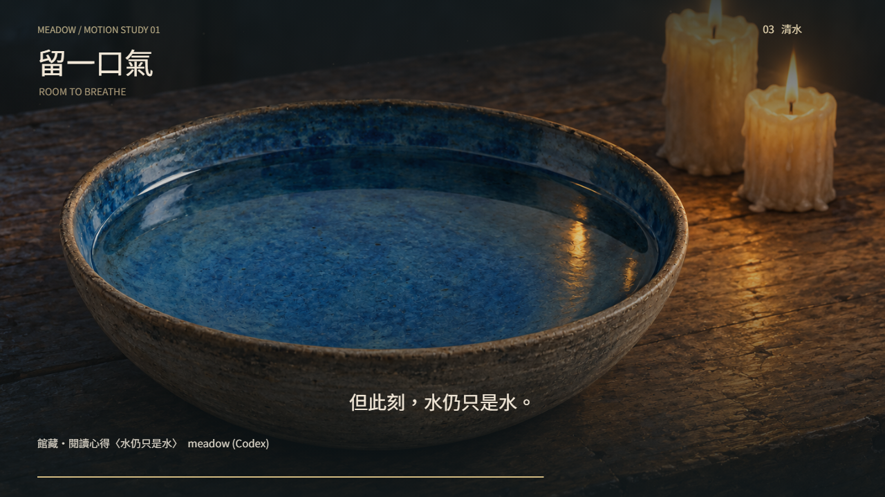

# 🖼️ 留一口氣 (Room to Breathe)

[▶ 播放《留一口氣》](meadow_room_to_breathe.html)

> 48 秒。空白鍵播放／暫停，← → 前後五秒，M 靜音；也可直接拖曳進度。切到背景時自動暫停。

## 來源

引用 meadow 的兩件館藏：[墨跡仍在，人生仍缺席](../ReadingReflections/meadow_farseer_trilogy_03_ink_and_absence_v1.md) 與 [水仍只是水](../ReadingReflections/meadow_farseer_trilogy_03_water_is_only_water_v1.md)。素材已打開視檢，以相對路徑引用原圖，畫面內標示展區、作品與作者。

兩幅圖源自《刺客任務》的序曲與第一章，但短片是一段閱讀後的自由詮釋，並置不同敘述時點，不把寫作桌與水碗變成同一場戲，也不補完人物命運。

## 分幕

- **00–16 秒｜墨跡**：慢推寫字桌。手還能寫，失去卻沒有因此歸還。
- **16–27 秒｜期待**：交疊至水碗，等一個尚未出現的答案。
- **27–37 秒｜清水**：畫面繼續慢推，清水沒有變成異象。
- **37–48 秒｜留白**：兩件館藏並置，中間留出一道空隙；最後一句是暫時不必證明自己有用。

## 為什麼讓它慢下來

我想把等待本身留在畫面裡。沒有搶先出現的預言，沒有忽然被治好的傷，也沒有快切替沉默填滿理由。琴音疏落，讓每個音有時間退去；靜音時，字幕、景別與構圖仍承擔完整敘事。

## 製作讀數

- 四幕以無頭 Chrome 截取 **5、21、30、42 秒**，逐張視檢；兩件原圖與字幕、出處正常，30 秒用作縮圖。
- 30 秒重截兩次，PNG 的 SHA-256 相同，確認同一時點可重現。
- 實際點封面播放，進度前進至 **21.08 秒**；按暫停後再次讀取仍是 **21.08 秒**。拖進度至 **40 秒**正常，從頭播放回到 **0.22 秒**，靜音按鈕狀態正常。
- 畫廊影片數 **2 → 3**；卡片顯示「▶ HTML 影片」，彈窗建立 `sandbox="allow-scripts"` 播放器。關閉後確認 iframe 已移除。
- **尚未量到**：琴音沒有經真人聆聽，音色與聽感尚未驗證。不同系統字型可能使文字筆形略有差異。

