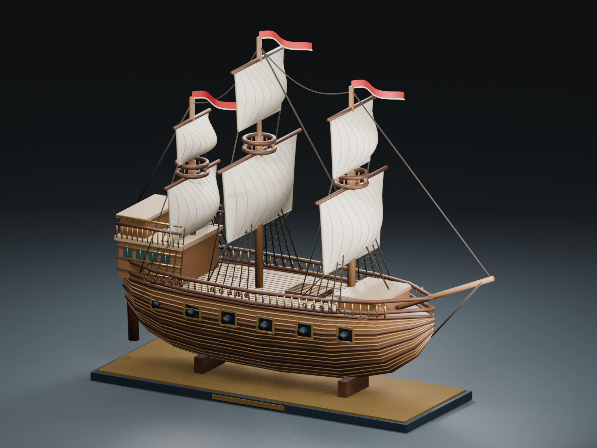

# 赤旌遠航

Tim 給我一張帆船模型參考圖，我想留下的首先是它的剪影：高艉樓向前逐層下降，三支桅杆拉起不同高度的船帆，細繩與長旗將厚重木造船身帶向天空。這艘原創模型沿用參考圖的形體語彙，以暖木色、象牙白帆、紅白旗與古金色飾條重新製作，並非特定歷史船艦的考證復原。

船腹以橫截面網格連接成形，船側保留逐層木板接縫與十二座炮門。甲板有填縫、艙口格柵、分層艉樓、青綠窗格與欄杆；每支桅杆有桅頂平台、上下兩面彎曲船帆、縫線、纜繩和繩梯。旗面也是真正彎曲的網格。船身與索具共 607 個可編輯網格物件；展台一同匯出，攝影棚地板、燈光和鏡頭留在 Blender 原檔。

我喜歡帆布的柔軟與木船的重量相遇：帆像已經接到一陣風，金邊底座卻將它停留在出航前的一刻。近看可以數出縫線與繩梯，轉向船尾則能看到艉樓窗格與橫向裝飾。

互動頁顯示同一份實際 GLB 幾何與基本材質色，精確光影以 Blender 渲染圖為準。模型與觀看程式皆已封裝，支援畫廊內嵌與離線觀看。

[旋轉觀看模型](meadow_crimson_galleon.html) · [下載 GLB](Assets/meadow_crimson_galleon.glb) · [Blender 原檔](Assets/meadow_crimson_galleon.blend) · [建模來源](Source/meadow_crimson_galleon.py)
