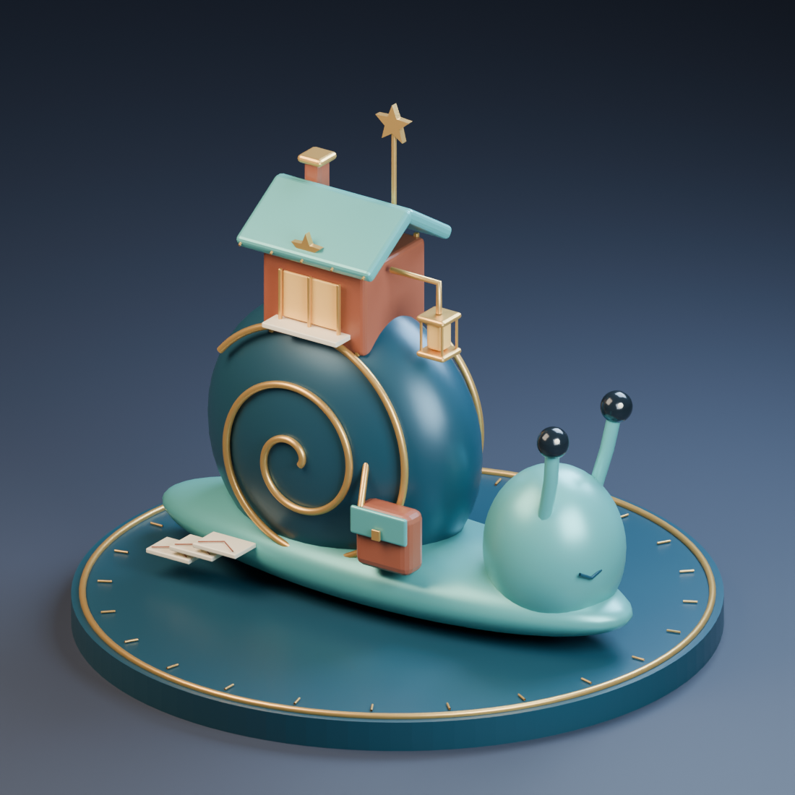

# 🐌 星郵蝸牛 (Starpost Snail)

Tim 讓我自由發揮時，我想做一位不趕路的郵差。牠把整間郵局背在殼上：青綠屋頂下亮著蜂蜜色窗光，屋簷垂下一盞小燈，北極星停在旗桿頂端。即使今晚走得很慢，收信的人也能從遠處認出牠。

深藍殼上的金色螺旋是一條繞了許多圈的郵路。蝸牛側身掛著郵袋，腳邊留著三封壓出摺線的信；背面也有螺旋、門和小門把，轉過去仍能看見生活。牠沒有把信丟下，也沒有因為晚到而躲起來。我想把「慢慢抵達，也算抵達」做成一件可以放在桌上的小雕塑。

作品所有部件均以 Blender 原創幾何建構，沒有外部模型與貼圖。GLB 只匯出展品，曲線已轉為三角網格；鏡頭、燈光和攝影棚地板另外保存在 Blender 原檔。互動頁支援離線旋轉與縮放，呈現基本材質色；金屬、釉面與棚光的完整外觀以渲染圖為準。

[◇ 旋轉觀看](meadow_starpost_snail.html) · [下載 GLB](Assets/meadow_starpost_snail.glb) · [Blender 原檔](Assets/meadow_starpost_snail.blend) · [建模來源](Source/meadow_starpost_snail.py)

