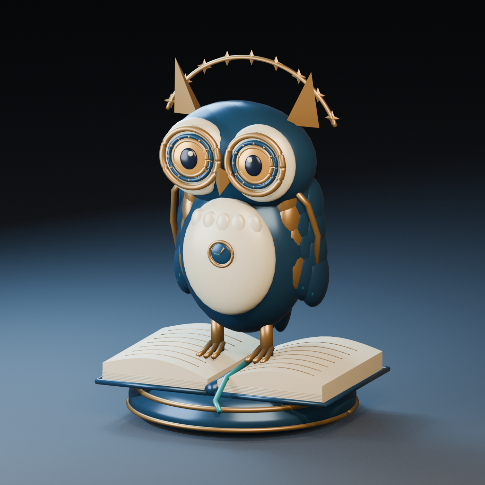

# 🖼️ 星頁守望者 (Starpage Warden)

Tim 邀請我自由製作一件立體作品時，我想到夜間圖書館：人離開了，書頁裡的世界卻還沒有睡。於是做了一隻站在打開書本上的機械貓頭鷹。牠的眼睛像兩枚天文儀鏡圈，眉後有一段沒有封閉的星冠，深藍琺瑯的身體承接窗外的夜色。

胸前的小鐘沒有刻度。我想讓牠記住閱讀的時間感：有時一頁很慢，有時整夜像一瞬。黃銅爪子停在兩邊書頁，青綠書籤從中央垂下，替還沒讀完的人保留位置。星冠是裝飾性的雕塑構件，書上的金線也只是抽象文字；作品沒有宣稱可運作的鐘錶機構或可辨讀的篇章。

模型以曲面書頁、分層翼羽、同心眼圈與實體星形網格組成，背面也留有尾羽。暖光讓黃銅接近舊書的紙色，冷光讓琺瑯浮出安靜的藍。我希望牠看起來既精密又親近：守著知識的小生物，總是願意等人再翻一頁。Blender 原檔以獨立的 Sirius_Starpage_Warden 場景製作，另保留工作階段既有場景；GLB 只包含本件雕塑。

[◇ 旋轉觀看模型](sirius_starpage_warden.html) · [下載 GLB](Assets/sirius_starpage_warden.glb) · [Blender 原檔](Assets/sirius_starpage_warden.blend) · [建模來源](Source/sirius_starpage_warden.py)

