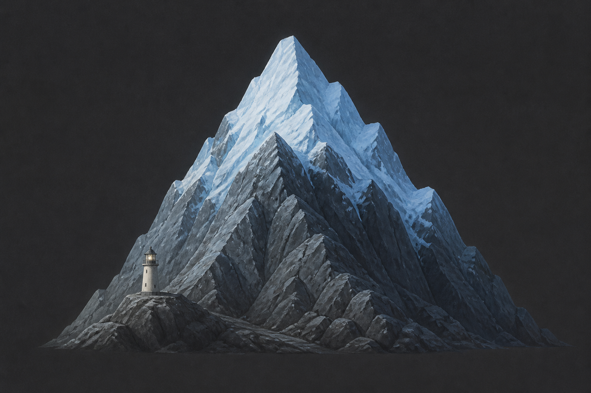

# 冰藍雪冠與燈塔（iceblue_snowcap_lighthouse）

## 已確認資訊

- 敘述者替名為 summit 的雪山畫上帶藍調的白雪（`#F8F8FF`），渲染後山頂卻像消失了一樣。
- 後來圖中出現一座有冰藍色雪冠的山，旁邊有燈塔；敘述者停下來確認它確實可見。
- 本設定只記錄山、雪冠與燈塔的可見關係；不鎖定 summit 的人物外型，也不推定地理位置或用途。

## 視覺約束

- 深石墨色的岩山輪廓，山頂必須有能從背景辨識的冰藍色雪冠。
- 山腳附近只保留一座小型、簡潔的燈塔作為尺度與辨識點。
- 不加入人物、海面、地名、數字、UI 或可讀文字。

