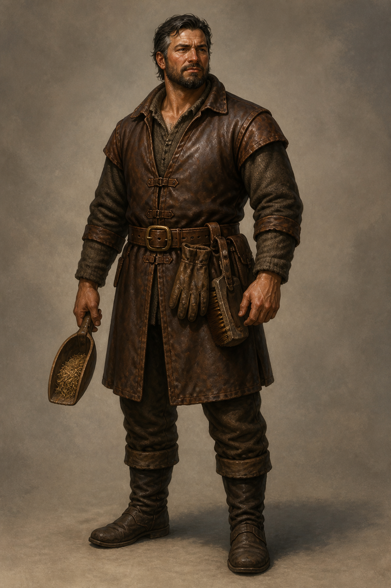

# 博瑞屈設定稿

**已確認外觀：** 壯年男性，曾受腿傷而略跛；長年在馬廄工作，衣物採耐髒的深棕皮革與粗羊毛，腰間可見刷具或餵料鏟等工作物。這是馬廄管理者，不是披甲戰士。

**人物設定：** 博瑞屈曾是駿騎最倚重的人，現在照料蜚滋、教他工作與服從。他將原智視為可能奪走孩子人性的危險，因而做出傷人的保護選擇；但在蜚滋因切德的考驗崩潰時，又用工作、食物、讓人不孤單的陪伴方式把他拉回來。後續畫面要保留他的嚴厲與笨拙的關心，不能只畫成冷酷監工。

