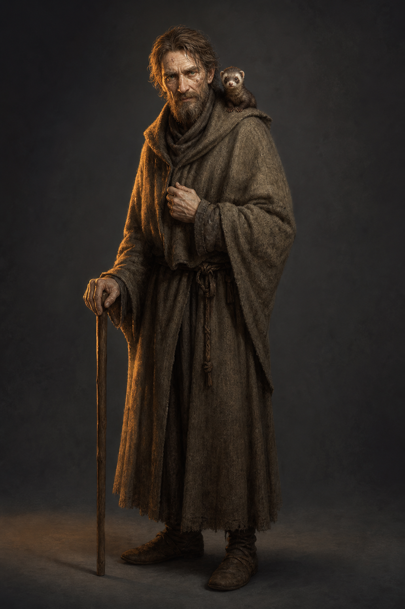

# 切德設定稿

**已確認外觀：** 年齡難辨的瘦削男性，灰褐色凌亂頭髮與鬍子，臉上有明顯痘疤，手部細瘦、皮膚蒼白，雙眼銳利而鮮綠；穿未染但陳舊的羊毛長袍，以手杖行走。棕色黃鼠狼「偷溜」是他的同伴，可在需要時作為次要元素。

**人物設定：** 切德教導蜚滋草藥、觀察、滲透、說謊與刺殺，卻也要求他對學習殺人一事說出真心。他以激烈的試探傷害過蜚滋，最終承認孩子拒絕偷國王物件是正確的。後續畫面不將他簡化成惡人或慈父：他的關懷與操控都確實存在。

