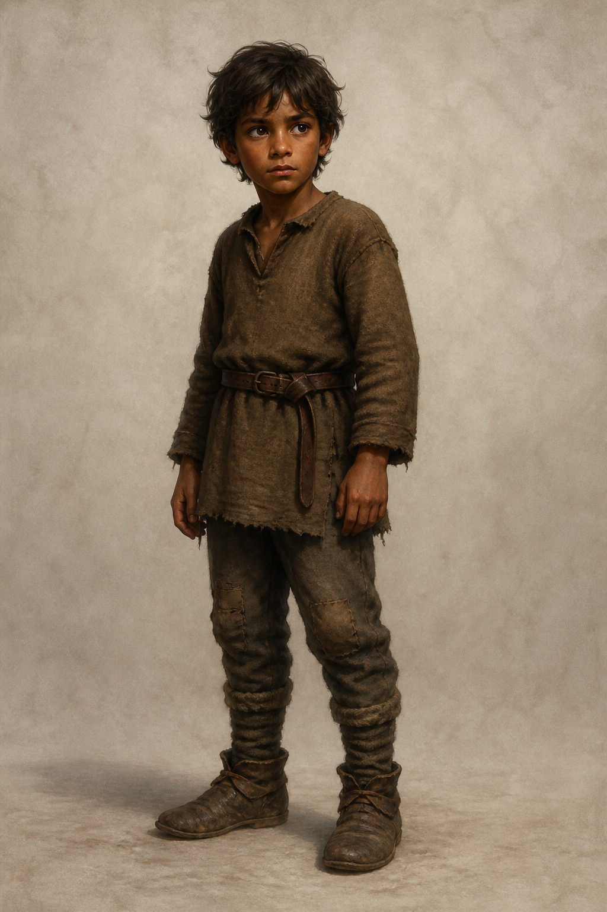

# 蜚滋・孩童期設定稿

**已確認外觀：** 約八歲，身形小而結實，深褐皮膚、深色凌亂短髮與深色眼睛；第一至五章的日常衣著是補綴過的棕色羊毛衣褲與磨損靴子。畫面不預先賦予成年傷痕、武器、正式爵位或後續服裝。

**人物設定：** 蜚滋被承認為皇室私生子，卻仍在理解「國王的人」究竟代表照料還是用途。他對動物有不尋常的感應，既渴望親近又因被奪走同伴而更會把想法收起來；到第五章，他已能在壓力下守住自己對忠誠的理解。後續場景應保留孩子的年齡感與警覺，不能把沉默畫成冷酷的成人姿態。

