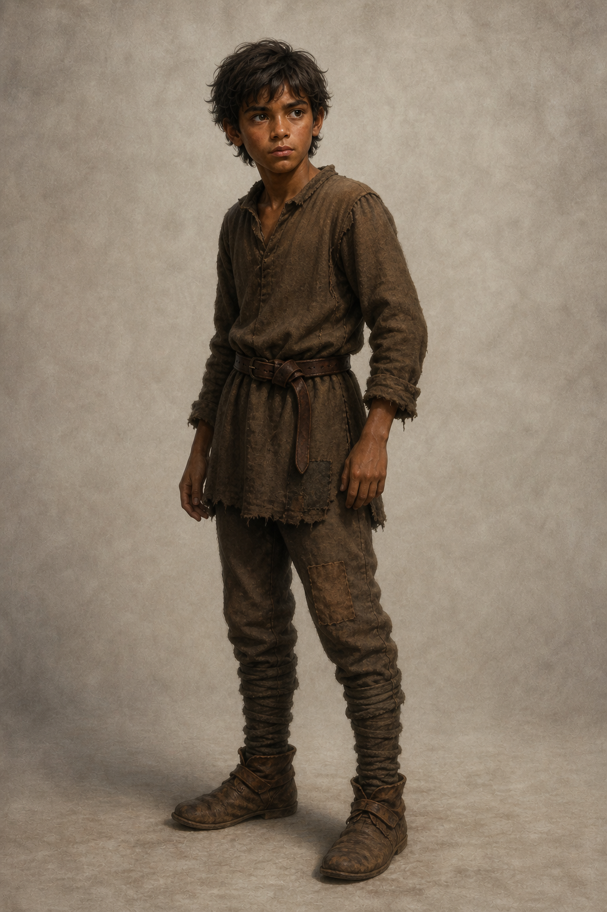

# 蜚滋・少年期設定稿

**已確認外觀：** 約十四歲，正快速長高但仍是瘦而結實的少年；深褐皮膚、深色凌亂短髮與深色眼睛。日常穿補綴的棕色羊毛衣褲、舊皮帶與磨損靴子；他仍在馬廄與城堡間做雜務，衣物不可畫成正式王室服裝。第一至十一章尚未明示的成年傷痕、武器、爵位或後續服裝都不加入。

**人物設定：** 冶鍊的消息讓蜚滋第一次更清楚地聽見大人對統治、責任與恐懼的分歧。他會觀察、會隱瞞自己知道的事，也仍會為靠近莫莉、為無法替國王辯護而慌張。後續場景保留他的少年感與尚未能安放的警覺，不能把沉默畫成成熟冷酷。

