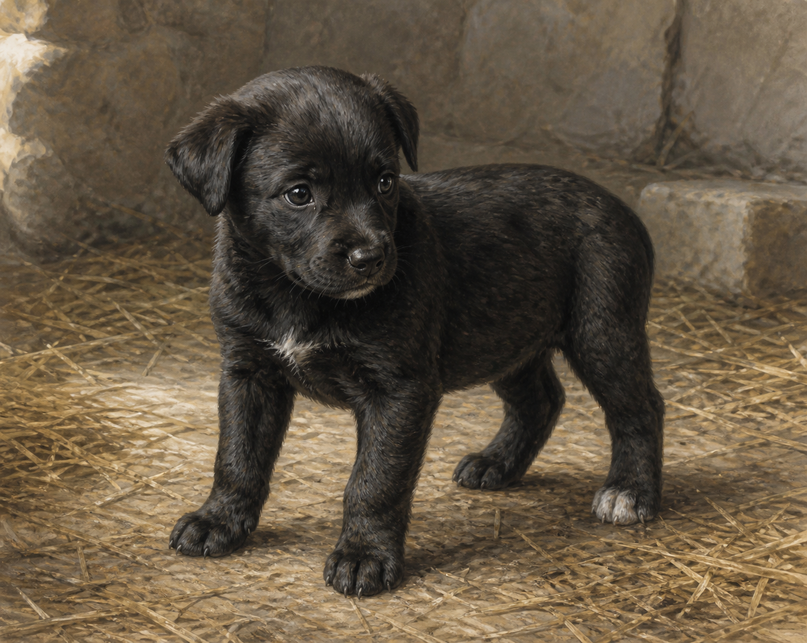

# 鐵匠設定稿

**已確認外觀：** 約八週大的健康黑色幼犬，毛皮平滑有光，將來可能長成帶淺色雜斑的硬毛；目前下巴有一小塊白色，左後腳也有白斑。牠有粗短的脖子、像煤斗般的口鼻，成年後也不會高過人的膝蓋；本章時仍是需要籃子、稻草與照料的小狗。

**人物設定：** 耐辛把鐵匠送給蜚滋時只是說「每個男孩都該有個寵物」，蜚滋卻立刻感到牠的意識異常清晰，並以原智安撫牠。牠不是大鼻子的替代品，而是蜚滋再次學會照料、被信任與把喜悅交出去的起點。後續畫面要保留幼犬的好奇和依賴，不能提早畫成成年獵犬或戴上未明示的項圈。

